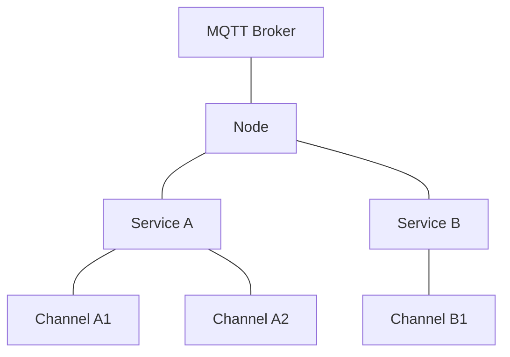
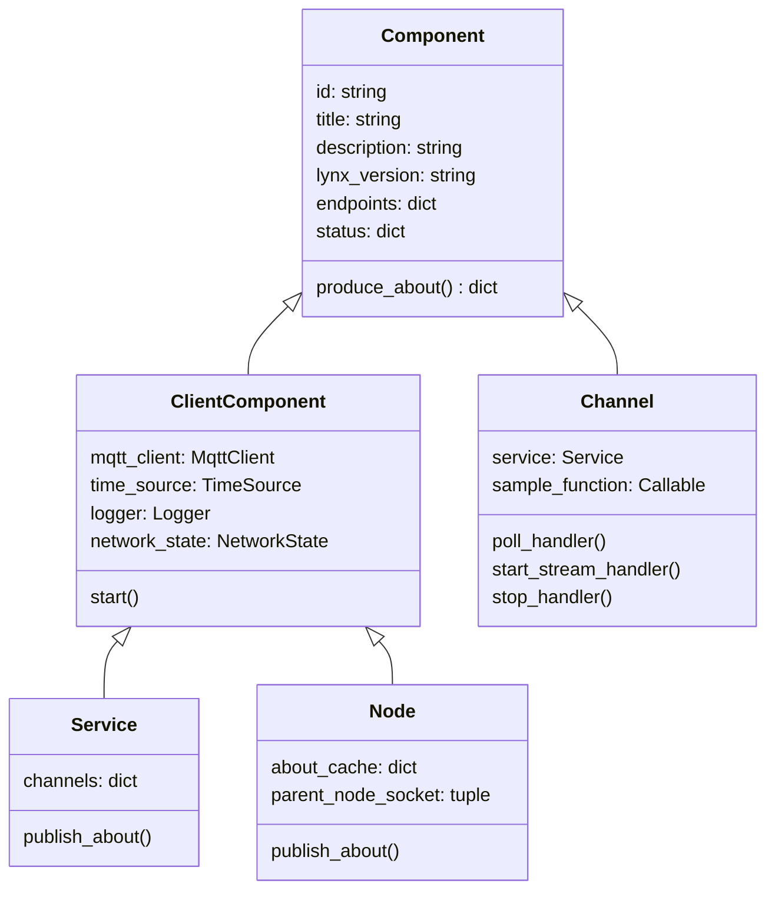
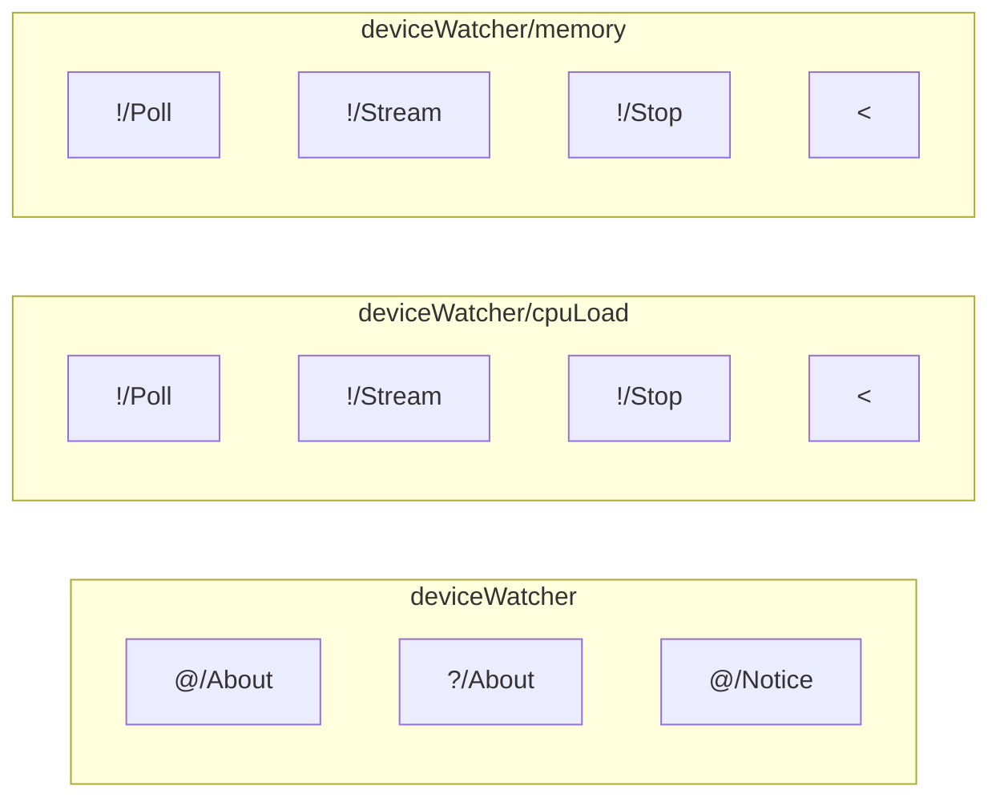
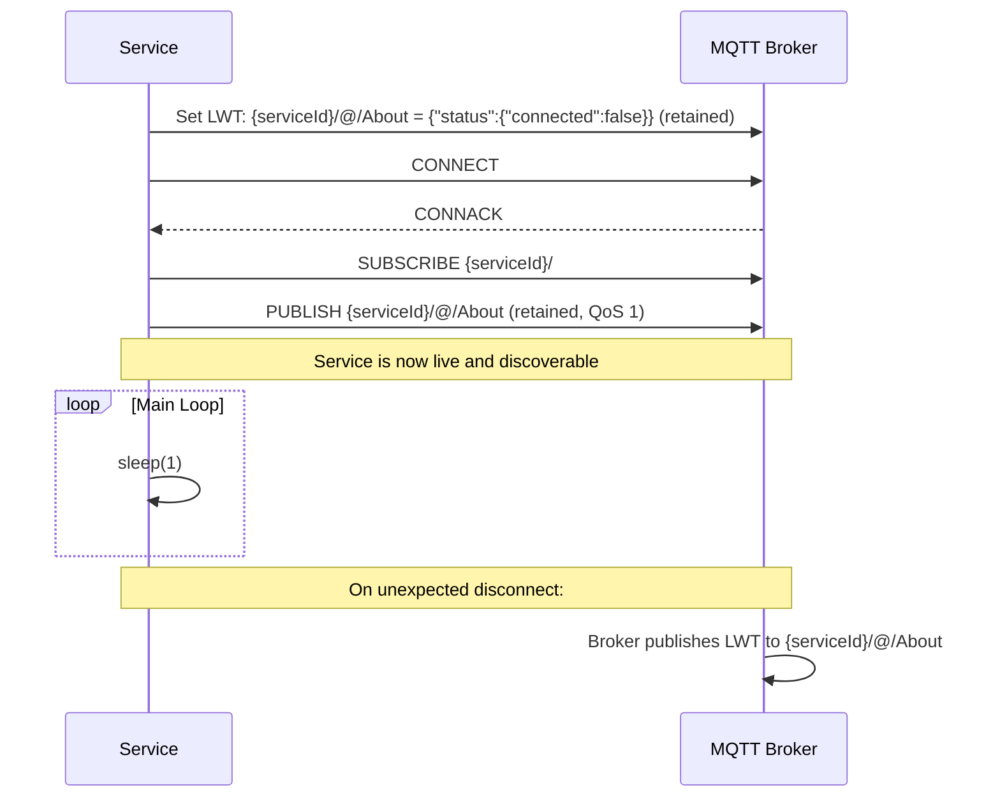
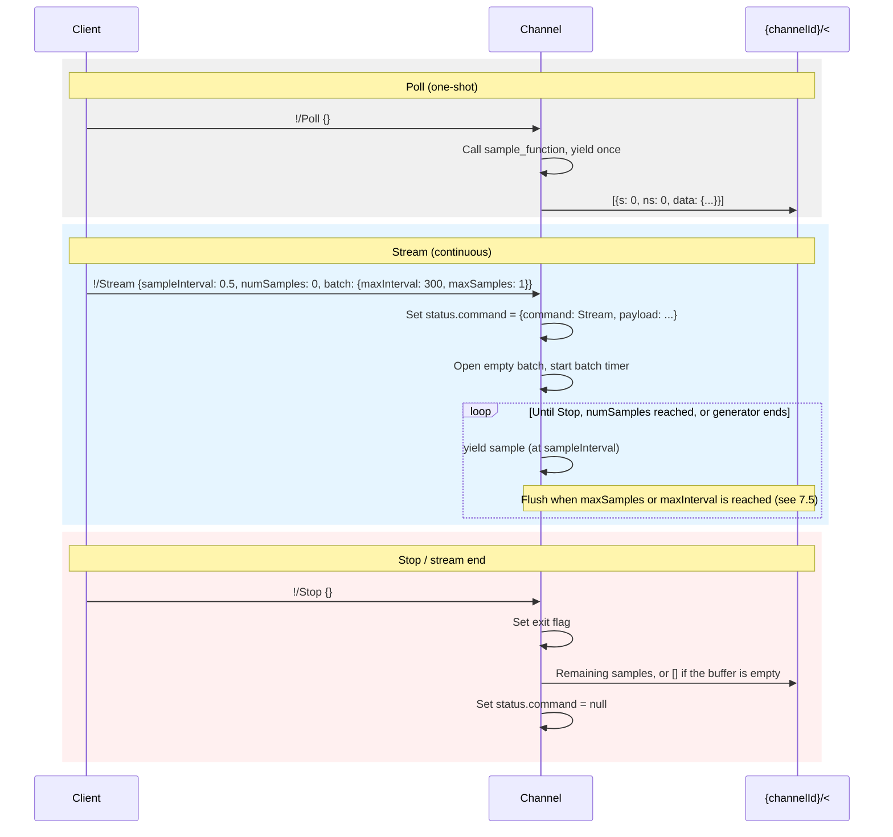
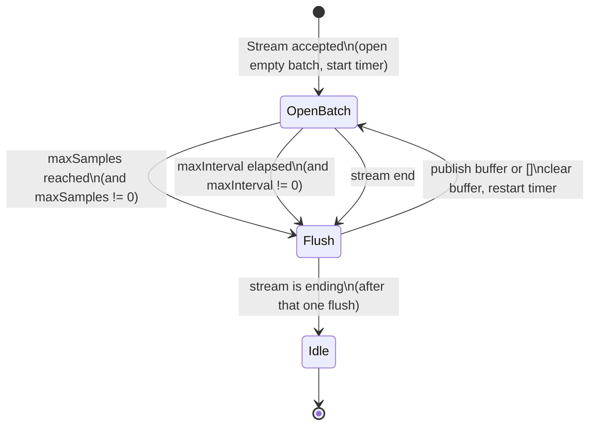
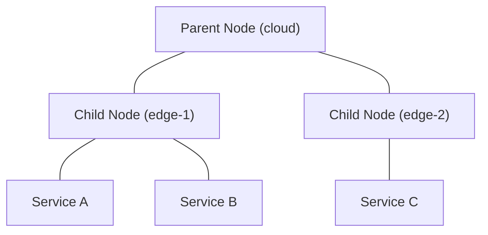
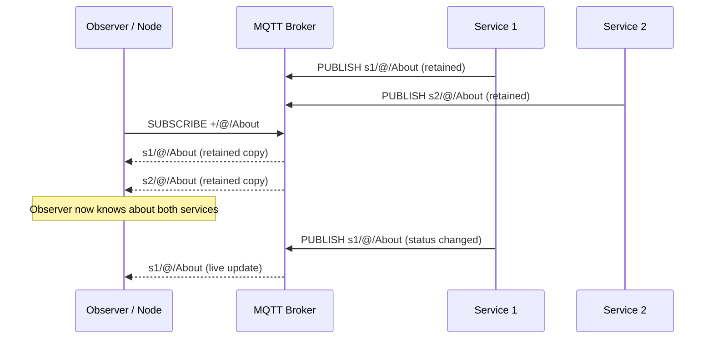

<!-- Generative AI was used in the Creation/Modification of this file -->
# The Lynx Protocol

**Version: A2.0**

---

## 1. Introduction

Lynx is a **Lightweight Network Extension of MQTT**. It defines a set of conventions on top of standard MQTT that give sensor networks self-describing services, structured data channels, automatic discovery, and schema-validated payloads -- all without replacing MQTT or requiring a custom broker.

Any standard MQTT client can participate in a Lynx network. Lynx simply defines *how* topics are named, *what* payloads look like, and *which* topics carry special meaning. The result is a network where every service advertises what it is, what data it produces, and what commands it accepts -- and where observers can discover and monitor the entire topology automatically.

### Design Philosophy

- **Minimal complexity.** Lynx adds structure to MQTT, not a new transport. If you know MQTT, you already know most of Lynx.
- **Self-describing.** Every Lynx component publishes an "About" payload that fully describes its identity, capabilities, endpoints, and current status.
- **Schema-enforced.** Payloads are JSON validated against JSON Schema (Draft 7), so producers and consumers agree on shape at protocol level.
- **Composable.** Services contain Channels; Nodes connect Services and other child Nodes. The hierarchy is simple and extensible.

---

## 2. Overview

Lynx organizes an MQTT broker into a layered hierarchy of **Nodes**, **Services**, and **Channels**.



| Layer | Role |
|-------|------|
| **Node** | Broker-adjacent coordinator. Monitors connected Services and child Nodes, maintains a NetworkState tree. |
| **Service** | Application boundary. Owns an MQTT client, a time source, and one or more Channels. Publishes a retained self-description. |
| **Channel** | Single data stream. Accepts Poll/Stream/Stop commands and publishes timestamped sample arrays. |

A Lynx network can run with just a Service connected to any MQTT broker -- Nodes are optional. Any vanilla MQTT client can subscribe to Lynx topics and consume the JSON payloads directly.

---

## 3. Use Cases

### 3.1 Ideal Fits

- **Sensor networks and device telemetry.** A Raspberry Pi publishing CPU load, temperature, and memory stats. An embedded device reporting accelerometer readings. Lynx's Channel abstraction maps naturally to periodic or event-driven sensor data.
- **Edge monitoring and fleet dashboards.** Nodes at the edge track which Services are alive, their status, and their channel states -- forming a real-time topology view.
- **Schema-enforced IoT data pipelines.** Every Channel declares its output schema. Consumers know the shape of the data before the first sample arrives.
- **Self-describing, discoverable service networks.** No external service registry needed. Subscribe to `+/@/About` and the network describes itself.
- **Rapid prototyping.** Define a Service, attach a Channel with a generator function, call `start()`. Data flows in seconds.
- **Lightweight data acquisition (DAQ) systems.** Stream parameters (`sampleInterval`, `numSamples`, `batch`) give fine-grained control over sampling rate and how samples are grouped into published messages.

### 3.2 Non-Ideal Fits

- **No TCP/IP network available.** Lynx is built on MQTT which requires TCP/IP. Additionally an MQTT broker or Lynx Node is required.
- **Heavy computation inside sampling loops.** CPU-bound or long-blocking work inside the sample function delays sample production. Batch flushes (including empty keepalives and the stream-end flush) MUST proceed independently of the sample function, but a blocked generator still cannot produce new samples until it returns.
- **Non-JSON / binary payloads.** Lynx payloads are JSON objects. Large binary data (images, video, raw ADC buffers) would need base64 encoding or an out-of-band mechanism.
- **Very large-scale deployments (1k+ devices).** Every Service publishes a retained `@/About` message. At extreme scale, the broker's retained message store and the wildcard subscription `+/@/About` may become bottlenecks.
- **RPC-heavy / request-response architectures.** Lynx is oriented around pub/sub data streams, not request-response patterns. While `?/About` is a query-response pattern, Channels are one-directional output streams.

---

## 4. Core Concepts

### 4.1 Component

The base entity in Lynx. Every Component has:

- **Identity**: `id`, `title`, `description`, `lynx_version`
- **Endpoints**: a set of MQTT topics it publishes to or subscribes on
- **Status**: an object describing mutable runtime status (`connected` for Services/Nodes; `command` for Channels)
- **About**: a method to produce a full self-description as a JSON object

### 4.2 Component Types



- **Service** and **Node** are *client components* -- they own an MQTT connection. A Channel does not; it accesses the broker through its parent Service.
- A Service contains zero or more Channels. A Node monitors zero or more Services and child Nodes.

### 4.3 Endpoints

An Endpoint is a single MQTT topic with:
- A **direction**: `sub` (subscribes and handles incoming messages), `pub` (publishes outgoing messages), or `pubsub`.
- A **payload schema**: JSON Schema (Draft 7) describing the expected payload.
- A **description**: human-readable purpose.

### 4.4 About

Every component can produce an "About" payload -- a JSON object that fully describes the component. Services and Nodes publish their About as a **retained** MQTT message so that new subscribers immediately receive the current state of the network.

### 4.5 Contents

A filtering mechanism that lets consumers request only the parts of a payload they care about. The `contents` parameter appears on `?/About` queries and on channel Poll/Stream commands. It supports several modes:

| `contents` value | Behavior |
|------------------|----------|
| `true` (or `{}`) | Return the full payload. |
| `false` | Return only values that changed since the last sample (change-of-value). |
| `{"key1": true, "key2": false}` | Select specific keys; per-key `true`/`false` controls inclusion or change-of-value. |
| `"<xxh32 hex string>"` | Return the payload only if its xxh32 hash differs from the provided hash. |

### 4.6 Endpoint Metadata

Each endpoint in a component's About is keyed by its full MQTT topic string and contains the following fields:

| Field | Type | Required | Applies to | Description |
|-------|------|----------|------------|-------------|
| `endpoint_direction` | string | yes | all | `"sub"`, `"pub"`, or `"pubsub"`. |
| `description` | string | no | all | Human-readable purpose of the endpoint. |
| `payload_schema` | object | no | all | JSON Schema (Draft 7) describing the payload shape. |
| `replyTopics` | array of strings | no | InEndpoints only | Nominal non-data reply topics (see below). |
| `dataOutput` | boolean | no | Channel InEndpoints only | Whether this endpoint may publish to the channel's `<` topic (see below). |

#### `replyTopics`

Declares the set of MQTT topics that each receive exactly **one** message in the nominal (non-error) flow of this endpoint. The array is **unordered**. Each entry must be a complete, absolute MQTT topic (e.g. `deviceWatcher/@/About`) -- wildcards (`+`, `#`) are not permitted.

Three-state semantics:

| Value | Meaning |
|-------|---------|
| *(omitted)* | The endpoint makes no declaration about replies. |
| `[]` (empty array) | The endpoint explicitly has no nominal reply. |
| `["topic1", ...]` | Each listed topic receives one message in the nominal flow. |

`replyTopics` only appears on InEndpoints (endpoints with `endpoint_direction` of `"sub"` or `"pubsub"`). OutEndpoints (direction `"pub"`) do not carry this field. The channel data topic (`<`) is never listed in `replyTopics` -- data output is signaled exclusively via `dataOutput`.

**Design note -- cross-component topics (allowed):** Entries may reference topics outside the declaring component's namespace. This enables aggregators and orchestrators to declare replies on other services' topics. The tradeoff is that consumers cannot assume replies stay within the advertiser's topic tree, and About validation cannot verify topic ownership.

**Design note -- no wildcards (disallowed):** Restricting entries to concrete topics keeps the "one message per listed topic" guarantee well-defined and avoids match-count ambiguity. The tradeoff is that reply sets like "every child's `@/About`" cannot be expressed compactly; each topic must be listed individually.

#### `dataOutput`

Declares whether an InEndpoint may cause data payloads to be published to the channel's data topic (`<`). This field is only valid on **Channel InEndpoints** (endpoints declared under a channel's About).

Three-state semantics:

| Value | Meaning |
|-------|---------|
| *(omitted)* | The endpoint makes no declaration about data output. |
| `true` | This endpoint may publish data payloads to the channel's `<` topic. |
| `false` | This endpoint explicitly does not publish data to `<`. |

Setting `dataOutput: true` is invalid if the channel does not have a `<` endpoint.

OutEndpoints (`<`, `@/About`, `@/Notice`) never carry `dataOutput`.

---

## 5. Topic Structure

Lynx uses symbolic prefixes in topic segments to distinguish system topics from data topics. The general pattern is:

```
{serviceId}/{channelId?}/{prefix}/{action}
```

### 5.1 Symbolic Prefixes

| Prefix | Name | Meaning | Example |
|--------|------|---------|---------|
| `@` | System | Published by the component automatically (About, Notice) | `deviceWatcher/@/About` |
| `?` | Query | Subscribe to receive a query; response published on `@` | `deviceWatcher/?/About` |
| `!` | Command | Channel commands (Poll, Stream, Stop) | `deviceWatcher/cpuLoad/!/Stream` |
| `<` | Output | Channel data output | `deviceWatcher/cpuLoad/<` |

### 5.2 Topic Tree Example

For a service `deviceWatcher` with channels `cpuLoad` and `memory`:



The full topic strings for this service are:

| Topic | Direction | QoS | Retained | Purpose |
|-------|-----------|-----|----------|---------|
| `deviceWatcher/@/About` | pub | 1 | yes | Service self-description |
| `deviceWatcher/?/About` | sub | -- | -- | Query service info |
| `deviceWatcher/@/Notice` | pub | 1 | no | Log/alert messages |
| `deviceWatcher/cpuLoad/!/Poll` | sub | -- | -- | Request a single sample |
| `deviceWatcher/cpuLoad/!/Stream` | sub | -- | -- | Start continuous sampling |
| `deviceWatcher/cpuLoad/!/Stop` | sub | -- | -- | Stop active sampling |
| `deviceWatcher/cpuLoad/<` | pub | 0 | no | Sample data output |
| `deviceWatcher/memory/!/Poll` | sub | -- | -- | Request a single sample |
| `deviceWatcher/memory/!/Stream` | sub | -- | -- | Start continuous sampling |
| `deviceWatcher/memory/!/Stop` | sub | -- | -- | Stop active sampling |
| `deviceWatcher/memory/<` | pub | 0 | no | Sample data output |

### 5.3 Topic Construction Rules

- **Service endpoints**: `{serviceId}/{prefix}/{action}` -- e.g., `deviceWatcher/@/About`
- **Channel endpoints**: `{serviceId}/{channelId}/{prefix}/{action}` -- e.g., `deviceWatcher/cpuLoad/!/Stream`
- **Node endpoints**: the Node's own About uses `{nodeId}/@/About`, but the monitor endpoint subscribes to `+/@/About` (a wildcard that catches all direct children).

---

## 6. Services

A Service is the primary application-level component in Lynx. It represents a single program or device that connects to the broker, publishes data through Channels, and describes itself via About.

### 6.1 Service Endpoints

Every Service automatically creates three endpoints:

**`{serviceId}/@/About`** (pub, QoS 1, retained)
Publishes the full self-description on connect and whenever state changes.

**`{serviceId}/?/About`** (sub)
Receives queries. When a message arrives, the Service produces its About, optionally trims it by the `contents` parameter in the request, and publishes a single message to `@/About`. This is declared via `replyTopics: ["{serviceId}/@/About"]`.

**`{serviceId}/@/Notice`** (pub, QoS 1, not retained)
Publishes log-level notices (DEBUG through CRITICAL) as structured JSON.

### 6.2 About Payload

The `@/About` payload for a Service looks like this:

```json
{
  "lynxType": "Service",
  "docs": {
    "id": "deviceWatcher",
    "title": "Device Watcher",
    "description": "Watches the device running this service and publishes statistics.",
    "lynx_version": "A2.0",
    "time_source": "unix"
  },
  "config": {},
  "status": {
    "connected": true
  },
  "endpoints": {
    "deviceWatcher/@/About": {
      "endpoint_direction": "pub",
      "description": "Publish information about the Component.",
      "payload_schema": { }
    },
    "deviceWatcher/?/About": {
      "endpoint_direction": "sub",
      "description": "Query information about the Component.",
      "payload_schema": { },
      "replyTopics": ["deviceWatcher/@/About"]
    },
    "deviceWatcher/@/Notice": {
      "endpoint_direction": "pub",
      "description": "Publish a notice about the Component.",
      "payload_schema": { }
    }
  },
  "channels": {
    "cpuLoad": {
      "lynxType": "Channel",
      "docs": { "id": "cpuLoad", "title": "CPU Load", "description": "Polls the CPU load", "lynx_version": "A2.0" },
      "config": {},
      "status": {
        "command": null
      },
      "endpoints": {
        "deviceWatcher/cpuLoad/!/Poll": {
          "endpoint_direction": "sub",
          "description": "Start polling at a set time interval on the channel for data.",
          "payload_schema": { },
          "replyTopics": [],
          "dataOutput": true
        },
        "deviceWatcher/cpuLoad/!/Stream": {
          "endpoint_direction": "sub",
          "description": "Start streaming on the channel, emitting data when available.",
          "payload_schema": { },
          "replyTopics": ["deviceWatcher/@/About"],
          "dataOutput": true
        },
        "deviceWatcher/cpuLoad/!/Stop": {
          "endpoint_direction": "sub",
          "description": "Stop polling or streaming on the channel.",
          "payload_schema": { },
          "replyTopics": ["deviceWatcher/@/About"],
          "dataOutput": false
        },
        "deviceWatcher/cpuLoad/<": {
          "endpoint_direction": "pub",
          "description": "Output data from the channel.",
          "payload_schema": { }
        }
      }
    }
  }
}
```

Key sections:

| Section | Mutability | Description |
|---------|-----------|-------------|
| `lynxType` | Immutable | Always `"Service"` for a Service. |
| `docs` | Immutable | Identity metadata: `id`, `title`, `description`, `lynx_version`, `time_source`. |
| `config` | Mutable | Runtime configuration. Application-defined. |
| `status` | Mutable | Current `connected` state. |
| `endpoints` | Immutable | Map of topic string to endpoint metadata (direction, schema, description, and optional `replyTopics` / `dataOutput`). |
| `channels` | Mixed | Map of channel ID to channel About (each channel has its own docs/config/status/endpoints). |

### 6.3 Service Lifecycle



### 6.4 Broker Resolution

When a Service (or Node) starts, it resolves the broker address in this priority order:

1. Environment variables `UPSTREAM_NODE_HOST` / `UPSTREAM_NODE_PORT`
2. `lynxConf.json` file in the working directory (`UpstreamNodeHost` / `UpstreamNodePort`)
3. Default: `localhost:1883`

### 6.5 Python SDK Example

```python
from lynx_sdk.components.service import Service

service = Service(
    id="deviceWatcher",
    title="Device Watcher",
    description="Watches the device running this service and publishes statistics.")

# ... add channels ...

if __name__ == "__main__":
    service.start()
```

---

## 7. Channels

A Channel is the data path within a Service. It encapsulates a single input/output data stream with a standardized command interface (Poll, Stream, Stop) and structured output.

### 7.1 Channel Endpoints

Every Channel creates four endpoints under its parent Service's topic namespace:

| Endpoint | Direction | `replyTopics` | `dataOutput` | Purpose |
|----------|-----------|---------------|--------------|---------|
| `{serviceId}/{channelId}/!/Poll` | sub | `[]` | `true` | Request a single sample |
| `{serviceId}/{channelId}/!/Stream` | sub | `["{serviceId}/@/About"]` | `true` | Start continuous sampling |
| `{serviceId}/{channelId}/!/Stop` | sub | `["{serviceId}/@/About"]` | `false` | Halt an active stream |
| `{serviceId}/{channelId}/<` | pub | -- | -- | Data output (array of timestamped samples) |

### 7.2 Poll / Stream / Stop Lifecycle



### 7.3 Output Format

Channel output is always a **JSON array** of sample objects. The array MAY be empty (`[]`).

```json
[
  {
    "s": 0,
    "ns": 0,
    "data": {
      "load": 23.5
    }
  },
  {
    "s": 1,
    "ns": 42000000,
    "data": {
      "load": 31.2
    }
  }
]
```

| Field | Type | Description |
|-------|------|-------------|
| `s` | integer | Seconds elapsed since the start of the current stream/poll |
| `ns` | integer | Nanoseconds remainder (0 to 999,999,999) |
| `data` | object | The sample data, validated against the channel's `output_data_schema` |

Timestamps are **relative to the start of the current stream** (or zero for a Poll), measured via a high-resolution performance counter. They do **not** reset when a batch is published -- every sample in every batch of a stream shares the same origin (see section 9.2).

An empty array `[]` is a valid data message. It is published when a batch flush occurs with no samples in the buffer (a keepalive / idle window, or a stream-end flush of an empty buffer). `[]` is **not** an end-of-stream marker -- consumers detect stream end from `status.command` becoming `null` on About.

### 7.4 Stream Parameters

The `!/Stream` request payload accepts these parameters. Omitted fields use the defaults below.

| Parameter | Type | Default | Description |
|-----------|------|---------|-------------|
| `contents` | object \| boolean | `{}` (= all) | Filter which keys to include in output data (see section 7.6) |
| `sampleInterval` | number | `1.0` | Requested seconds between samples. `0` = sample as fast as the generator allows. |
| `numSamples` | integer | `0` | Total samples to admit into batches. `0` = infinite, `n` = stop after n admitted samples. |
| `batch` | object | see below | Flush limits for the open batch. Omitted `batch` (or omitted fields inside it) uses the field defaults. |

**`batch` object:**

| Field | Type | Default | Description |
|-------|------|---------|-------------|
| `maxInterval` | number | `300` | Max seconds an open batch may wait before it is published. `0` = no time limit (time-based flush disabled, including empty keepalives). |
| `maxSamples` | integer | `1` | Max samples in one published message. `0` = no count limit. |

`!/Poll` does not accept `sampleInterval`, `numSamples`, or `batch`. Poll is always one sample in one message.

Example -- high-rate DAQ, flush on count or time:

```json
{
  "sampleInterval": 0.001,
  "batch": {
    "maxInterval": 0.1,
    "maxSamples": 1000
  }
}
```

Up to 1000 samples per message, or a flush every 0.1 s, whichever happens first. If 0.1 s elapses with nothing in the buffer, the channel publishes `[]`.

### 7.5 Batching

Sampling and batching are **separate operations**. A Stream maintains one **open batch** (a buffer of samples not yet published) and a **batch timer**. Implementations MUST honor the flush rules below even if the sample function is blocked or slow. How the runtime is scheduled -- SDK thread today, application event loop later -- is out of band; the operations and their triggers are not.



#### Operations

| Operation | When | Effect |
|-----------|------|--------|
| **start_stream** | `!/Stream` accepted | Set `status.command`. Open an empty batch. Start the batch timer. Begin sampling at `sampleInterval`. |
| **add_sample** | The sample function yields a value | Apply `contents` filtering. If the result is empty, **discard** the yield -- it does not enter the batch and does not count toward `batch.maxSamples` or `numSamples`. Otherwise append it with stream-relative `s`/`ns`. If `maxSamples > 0` and the buffer length is now `>= maxSamples`, **flush**. If `numSamples > 0` and admitted samples now equal `numSamples`, **end_stream**. |
| **on_max_interval** | `maxInterval > 0` and that many seconds have elapsed since the timer started or last reset | **flush**, even if the buffer is empty. MUST fire independently of the sample function. |
| **flush** | Any trigger above | Publish the buffer to `<` as a JSON array. If the buffer is empty, publish `[]`. Clear the buffer. If the stream is still active, restart the batch timer. The stream-end flush does not open a new batch. |
| **end_stream** | `!/Stop`, `numSamples` reached, or the sample function finishes | **flush** once (including `[]` if the buffer is already empty). Set `status.command` to `null`. |

These operations on a given channel MUST be serialized: a sample is admitted to exactly one batch, and a flush publishes exactly the samples admitted since the previous flush. `add_sample` and `on_max_interval` must not interleave mid-operation.

The batch timer **starts at Stream start**, before any samples, and **resets on every count, time, or empty flush**. The stream-end flush does not reset it. A new open batch never inherits leftover time from the previous one.

Whichever limit is reached first flushes the current batch. If both would fire at the same instant, publish **one** message, not two.

#### Limit values of `0`

| `maxInterval` | `maxSamples` | Behavior |
|---------------|--------------|----------|
| `> 0` | `> 0` | Flush when either limit is reached (including `[]` on timeout with an empty buffer). |
| `> 0` | `0` | Time-only: flush every `maxInterval` seconds, including `[]` when idle. Count never triggers. |
| `0` | `> 0` | Count-only: flush when the buffer reaches `maxSamples`. No empty keepalives. |
| `0` | `0` | Hold until stream end. One final publish of the entire buffer (or `[]` if nothing was admitted). Unbounded memory if the stream is long. |

#### `numSamples` vs `batch.maxSamples`

- `batch.maxSamples` is per published message.
- `numSamples` is the stream-lifetime cap on samples **admitted into batches** (after `contents` filtering). `0` means no cap.
- Reaching `numSamples` ends the stream (one final flush). It does not change how the open batch flushes before that.

#### Empty arrays are not end-of-stream

`[]` is published whenever a flush runs against an empty buffer: an idle `maxInterval` window, or a final flush after the last count-based publish already emptied the buffer. A stream that ends with samples still buffered publishes those samples and does **not** send an extra trailing `[]`. Consumers MUST use About `status.command`, not `[]`, to detect that a stream has ended.

#### Independence from the sample function

`on_max_interval` and `end_stream` (from `!/Stop`) MUST be able to **flush** while the sample function is blocked. `add_sample` is the only operation that depends on the generator. This keeps batching well-defined when publishing later moves to an application-owned event loop: the loop is responsible for invoking these operations on time; the channel definition only declares the rules.

#### Worked examples

**Default-like Stream** (`{}` or omitted `batch`): `sampleInterval=1.0`, `maxInterval=300`, `maxSamples=1`. Each admitted sample publishes immediately as a one-element array. `[]` appears only if nothing is admitted for 300 s (blocked generator, or every yield dropped by `contents`).

**High-rate DAQ** (`sampleInterval=0.001`, `maxInterval=0.1`, `maxSamples=1000`): a full batch of 1000 publishes as soon as it fills; otherwise the open batch publishes at 0.1 s. Silence for 0.1 s yields `[]`.

**`numSamples=5`, `maxSamples=1`:** five one-sample messages, then a final `[]` because the fifth flush already emptied the buffer.

**`numSamples=5`, `maxSamples=10`:** five samples accumulate, then stream end flushes those five. No extra `[]`.

### 7.6 The `contents` Filtering Mechanism

The `contents` parameter provides flexible control over what data is included in channel output and About responses. It operates recursively on the payload:

**Boolean mode:**
- `true` (or `{}`) -- include the full payload, no filtering.
- `false` -- change-of-value mode. Only include values that differ from the previous sample.

**Dict mode:**
```json
{
  "total": true,
  "percent": true,
  "used": false,
  "free": false
}
```
Select specific keys. Each key maps to its own `contents` rule (can nest dicts for deep structures). Keys set to `true` are always included; keys set to `false` use change-of-value.

On a Stream, `contents` is applied **before** a yield enters the open batch. A yield that trims to `{}` is discarded: it is not published, and it does not count toward `batch.maxSamples` or `numSamples`.

**String mode (xxhash):**
```json
"a3b2c1d0"
```
The string is interpreted as an xxh32 hex digest. The payload is hashed and compared. If it matches, nothing is returned (no change). If it differs, the new hash (or the full payload) is returned.

### 7.7 The Sample Function

A Channel's data source is a **generator function** with the signature:

```python
def sample_function(request: InboundMessage, continue_sampling: Callable) -> Generator[dict, None, None]:
    while continue_sampling(default_interval=1.0):
        yield {"load": get_cpu_load()}
```

- `request` -- the original Poll or Stream message, including any parameters.
- `continue_sampling(default_interval)` -- returns `True` if the Channel should keep sampling, `False` if a Stop was received or the stream has ended. The `default_interval` is the sleep used when the Stream payload omits `sampleInterval`. A present `sampleInterval` overrides it. `sampleInterval` (or the default) of `0` means no sleep -- sample as fast as the generator allows.
- Each `yield` is offered to the batcher (`add_sample`). It is not published by itself. Publishing happens only on **flush** (see section 7.5).

Sampling cadence (`sampleInterval`) and batch flush (`batch.maxInterval` / `batch.maxSamples`) are independent. A slow yield delays the next `add_sample`; it must not delay `on_max_interval` or a Stop-driven `end_stream`.

### 7.8 Python SDK Example

**Decorator style:**

```python
@service.new_channel(
    "cpuLoad",
    title="CPU Load",
    description="Polls the CPU load",
    output_data_schema={"load": {"type": "number", "unit": "%"}})
def sample_cpu_load(request, continue_sampling):
    while continue_sampling(default_interval=0.5):
        yield {"load": psutil.cpu_percent(interval=0.1)}
```

**Explicit style:**

```python
channel = Channel(
    id="memory",
    service=service,
    title="RAM Status",
    description="RAM status of the system",
    sample_function=sample_memory_status,
    output_data_schema=MEMORY_SCHEMA)

service.add_channel(channel)
```

---

## 8. Nodes

A Node is a broker-adjacent component that monitors the Lynx network. It tracks which Services are connected, their status, and the status of their Channels. Nodes form the topology layer of Lynx.

### 8.1 Node Endpoints

A Node creates these endpoints:

| Endpoint | Direction | Purpose |
|----------|-----------|---------|
| `{nodeId}/@/About` | pub | Node self-description (retained) |
| `{nodeId}/?/About` | sub | Query node info |
| `{nodeId}/@/Notice` | pub | Log/alert messages |
| `+/@/About` | sub | Wildcard monitor: catch About messages from all direct children |

The `+/@/About` subscription uses the MQTT `+` single-level wildcard to match any component ID at one topic level. This means a Node sees the About messages of all Services and child Nodes connected to the same broker.

### 8.2 Node About Payload

A Node's About extends the base About with `services` and `child_nodes`:

```json
{
  "lynxType": "Node",
  "docs": {
    "id": "edgeNode01",
    "title": "Edge Node 01",
    "description": "Monitors sensors on floor 3.",
    "lynx_version": "A2.0",
    "time_source": "unix"
  },
  "config": {},
  "status": {
    "connected": true
  },
  "endpoints": { },
  "services": {
    "deviceWatcher": {
      "lynxType": "Service",
      "docs": { },
      "status": { "connected": false },
      "channels": { }
    }
  },
  "child_nodes": {}
}
```

The `services` and `child_nodes` maps are populated automatically as the Node receives About messages on `+/@/About`.

### 8.3 Multi-Node Topology

Nodes can be nested. A parent Node can track child Nodes, each of which tracks their own Services:



Each Node maintains a **NetworkState** -- a hierarchical in-memory model of the network tree beneath it:

```json
{
  "services": {
    "serviceA": { "lynxType": "Service", "status": { "connected": true }, "channels": {} },
    "serviceB": { "lynxType": "Service", "status": { "connected": true }, "channels": {} }
  },
  "childNodes": {
    "childNode1": {
      "services": { },
      "childNodes": { }
    }
  }
}
```

### 8.4 Python SDK Example

```python
from lynx_sdk.components.node import Node

node = Node(
    id="exampleNode",
    title="Example Node",
    description="Example Node for Lynx.",
    lynx_version="A2.0")

if __name__ == "__main__":
    node.start()
```

---

## 9. Timestamps

Lynx uses two distinct timestamp mechanisms that serve different purposes.

### 9.1 MQTT v5 User Properties (Publish-Time Stamps)

Every message published by a Lynx component includes MQTT v5 User Properties `s` (seconds) and `ns` (nanoseconds) recording when the message was published according to the component's TimeSource.

These properties are set at the MQTT protocol level and are available on *every* Lynx message (About, Notice, Channel output, etc.).

```
MQTT v5 User Properties:
  s  = "1716580000"
  ns = "123456789"
```

### 9.2 Channel Sample Timestamps (Stream-Relative)

Inside a Channel's output array, each sample carries its own `s` and `ns` fields. These are **relative to the start of the current stream**, measured using a high-resolution performance counter (`time.perf_counter_ns()`).

```json
[
  { "s": 0, "ns": 0,         "data": { "load": 12.3 } },
  { "s": 0, "ns": 500000000, "data": { "load": 14.1 } },
  { "s": 1, "ns": 0,         "data": { "load": 13.7 } }
]
```

This means:
- Sample 1 was taken at stream start (t=0).
- Sample 2 was taken 500ms after stream start.
- Sample 3 was taken 1 second after stream start.

The origin is the start of the Stream, not the start of the current batch. Publishing a batch (including an empty `[]`) does not reset sample `s`/`ns`.

For a Poll, both `s` and `ns` are always `0` (single sample, no relative offset). Empty `[]` messages have no sample timestamps; MQTT v5 User Properties on the publish still record when the message was sent (section 9.1).

### 9.3 TimeSource Variants

| TimeSource | Epoch | Use Case |
|------------|-------|----------|
| `UnixTimeSource` | 1970-01-01 | Standard systems (Linux, Windows, macOS). Uses `time.time_ns()`. |
| `Epoch2000TimeSource` | 2000-01-01 | MicroPython devices where `time.time()` starts at year 2000. Adds the epoch delta automatically. |
| `ProcessPerfTimeSource` | Process start | Devices with no real-time clock. Uses `time.perf_counter_ns()` relative to process start. |

The SDK automatically selects the appropriate TimeSource by checking `time.gmtime(0)`:
- Year 1970 -> `UnixTimeSource`
- Year 2000 -> `Epoch2000TimeSource`
- Other -> `ProcessPerfTimeSource`

---

## 10. Discovery and Network State

### 10.1 Retained About as a Service Registry

When a Service connects, it publishes its full About payload to `{serviceId}/@/About` with `retain=True` and `QoS=1`. This means:

- Any client that subscribes to `{serviceId}/@/About` or `+/@/About` immediately receives the last known state, even if the Service published it hours ago.
- The broker stores exactly one retained About per Service, so the retained message store grows linearly with the number of Services.

This effectively turns the broker into a **service registry** with no additional infrastructure.

### 10.2 Querying with `?/About`

To request a fresh About (or a filtered subset), publish to `{serviceId}/?/About`:

```json
{}
```

Returns the full About. Or with `contents` filtering:

```json
{
  "contents": {
    "status": true,
    "channels": {
      "cpuLoad": {
        "status": true
      }
    }
  }
}
```

Returns only the requested subtree.

### 10.3 Discovery Flow



### 10.4 NetworkState

Nodes (and optionally Services with `track_network_state=True`) maintain a `NetworkState` object. This is a hierarchical dict:

```json
{
  "services": {
    "deviceWatcher": { "lynxType": "Service", "docs": {}, "status": {}, "channels": {} },
    "temperatureSensor": { "lynxType": "Service", "docs": {}, "status": {}, "channels": {} }
  },
  "childNodes": {
    "edgeNode02": {
      "services": {},
      "childNodes": {}
    }
  }
}
```

Every incoming About message on `+/@/About` is parsed, and the component is placed into the appropriate branch based on its `lynxType`:

- `"Service"` (or any payload containing `channels` or `services`) -> `services[id]`
- `"Node"` (or any payload containing `childNodes`) -> `childNodes[id]`

### 10.5 Last Will and Testament (LWT)

When a Service or Node connects, it sets an MQTT Last Will:

- **Topic**: `{componentId}/@/About`
- **Payload**: `{"status":{ "connected": false }}`
- **QoS**: 1
- **Retain**: true

If the client disconnects unexpectedly, the broker publishes this LWT message. NetworkState handles it as a **partial About update** -- it merges the `status` into the existing entry without replacing the full About.

---

## 11. Notices

Notices are Lynx's structured logging mechanism. They bridge component-level events to MQTT so that observers can monitor health and debug issues remotely.

### 11.1 Notice Payload

Published to `{componentId}/@/Notice` (QoS 1, not retained):

```json
{
  "action": "Stream",
  "severity": "WARNING",
  "message": "Channel 'cpuLoad' is already streaming, ignoring stream start request.",
  "data": {}
}
```

| Field | Type | Description |
|-------|------|-------------|
| `action` | string | The command or query in execution when the notice was published. Empty if not related to a specific action. |
| `severity` | string | One of: `DEBUG`, `INFO`, `WARNING`, `ERROR`, `CRITICAL`. |
| `message` | string | Human-readable notice message. |
| `data` | object | Additional structured data. Often empty. |

### 11.2 Severity Levels

| Severity | Value | Use |
|----------|-------|-----|
| `DEBUG` | 10 | Detailed diagnostic info (connection events, endpoint handling). |
| `INFO` | 20 | General operational messages. |
| `WARNING` | 30 | Unexpected but recoverable situations (duplicate stream request, unknown topic). |
| `ERROR` | 40 | Failures that affect a single operation (payload validation failure, handler exception). |
| `CRITICAL` | 50 | System-level failures. |

### 11.3 Python Logging Bridge

In the Python SDK, the `LoggingNoticeHandler` bridges Python's standard `logging` module to MQTT notices. Any log message at INFO or above is automatically published as a Notice, with the log record's timestamp preserved in the MQTT v5 User Properties.

---

## Appendix A: JSON Schemas

### A.1 Service About (`@/About`)

```json
{
  "$schema": "http://json-schema.org/draft-07/schema#",
  "type": "object",
  "properties": {
    "lynxType": {
      "type": "string",
      "enum": ["Service"],
      "description": "The type of the Lynx Component."
    },
    "docs": {
      "type": "object",
      "properties": {
        "id": { "type": "string", "description": "Unique identifier of the Component." },
        "title": { "type": "string", "description": "Human-readable title." },
        "description": { "type": "string", "description": "Human-readable description." },
        "lynx_version": { "type": "string", "enum": ["A2.0"], "description": "Lynx protocol version." },
        "time_source": { "type": "string", "description": "Time source type (e.g., 'unix', 'process')." }
      }
    },
    "config": {
      "type": "object",
      "description": "Mutable runtime configuration."
    },
    "status": {
        "connected": {
            "title": "Connected",
            "description": "Whether the Service is connected to the Lynx network.",
            "type": "boolean"
        }
    },
    "endpoints": {
      "type": "object",
      "description": "Map of topic string to endpoint metadata.",
      "additionalProperties": {
        "type": "object",
        "properties": {
          "endpoint_direction": { "type": "string", "enum": ["sub", "pub", "pubsub"] },
          "description": { "type": "string" },
          "payload_schema": { "type": "object" },
          "replyTopics": {
            "type": "array",
            "items": { "type": "string", "minLength": 1 },
            "uniqueItems": true,
            "description": "Unordered complete MQTT topics that each receive one nominal non-data reply. Omitted = undeclared; empty = no nominal reply. InEndpoints only."
          }
        }
      }
    },
    "channels": {
      "type": "object",
      "description": "Map of channel ID to channel About object.",
      "additionalProperties": { "$ref": "#/definitions/channelAbout" }
    }
  },
  "definitions": {
    "channelAbout": {
      "type": "object",
      "properties": {
        "lynxType": { "type": "string", "enum": ["Channel"] },
        "docs": {
          "type": "object",
          "properties": {
            "id": { "type": "string" },
            "title": { "type": "string" },
            "description": { "type": "string" },
            "lynx_version": { "type": "string", "enum": ["A2.0"] }
          }
        },
        "config": { "type": "object" },
        "status": {
          "type": "object",
          "properties": {
            "command": {
              "description": "Active command object, or null when idle.",
              "oneOf": [
                { "type": "null" },
                {
                  "type": "object",
                  "properties": {
                    "command": { "type": "string" },
                    "payload": { "type": "object" }
                  }
                }
              ]
            }
          }
        },
        "endpoints": {
          "type": "object",
          "description": "Map of topic string to channel endpoint metadata.",
          "additionalProperties": {
            "type": "object",
            "properties": {
              "endpoint_direction": { "type": "string", "enum": ["sub", "pub", "pubsub"] },
              "description": { "type": "string" },
              "payload_schema": { "type": "object" },
              "replyTopics": {
                "type": "array",
                "items": { "type": "string", "minLength": 1 },
                "uniqueItems": true,
                "description": "Unordered complete MQTT topics that each receive one nominal non-data reply. Omitted = undeclared; empty = no nominal reply. InEndpoints only."
              },
              "dataOutput": {
                "type": "boolean",
                "description": "If true, this InEndpoint may publish payloads to the channel's < topic. Omitted = undeclared; false = explicitly no data output. Invalid if true and the channel has no < endpoint."
              }
            }
          }
        }
      }
    }
  }
}
```

### A.2 Node About (`@/About`)

Extends the Service About schema with `services` and `child_nodes`:

```json
{
  "$schema": "http://json-schema.org/draft-07/schema#",
  "type": "object",
  "properties": {
    "lynxType": { "type": "string", "enum": ["Node"] },
    "docs": {
      "type": "object",
      "properties": {
        "id": { "type": "string" },
        "title": { "type": "string" },
        "description": { "type": "string" },
        "lynx_version": { "type": "string", "enum": ["A2.0"] },
        "time_source": { "type": "string" }
      }
    },
    "config": { "type": "object" },
    "status": {
      "connected": {
        "title": "Connected",
        "description": "Whether the Node is connected to the Lynx network.",
        "type": "boolean"
      }
    },
    "endpoints": {
      "type": "object",
      "description": "Map of topic string to endpoint metadata.",
      "additionalProperties": {
        "type": "object",
        "properties": {
          "endpoint_direction": { "type": "string", "enum": ["sub", "pub", "pubsub"] },
          "description": { "type": "string" },
          "payload_schema": { "type": "object" },
          "replyTopics": {
            "type": "array",
            "items": { "type": "string", "minLength": 1 },
            "uniqueItems": true,
            "description": "Unordered complete MQTT topics that each receive one nominal non-data reply. Omitted = undeclared; empty = no nominal reply. InEndpoints only."
          }
        }
      }
    },
    "services": {
      "type": "object",
      "description": "Map of service ID to service About object."
    },
    "child_nodes": {
      "type": "object",
      "description": "Map of child node ID to node About object (recursive)."
    }
  }
}
```

### A.3 Notice (`@/Notice`)

```json
{
  "$schema": "http://json-schema.org/draft-07/schema#",
  "type": "object",
  "properties": {
    "action": {
      "type": "string",
      "description": "The command or query in execution when the notice was published."
    },
    "severity": {
      "type": "string",
      "enum": ["DEBUG", "INFO", "WARNING", "ERROR", "CRITICAL"]
    },
    "message": {
      "type": "string",
      "description": "Human-readable notice message."
    },
    "data": {
      "type": "object",
      "description": "Additional structured data."
    }
  }
}
```

### A.4 Poll Request (`!/Poll`)

```json
{
  "$schema": "http://json-schema.org/draft-07/schema#",
  "type": "object",
  "properties": {
    "contents": {
      "type": ["object", "boolean"],
      "default": {},
      "description": "Filter which keys to include in output data."
    }
  }
}
```

### A.5 Stream Request (`!/Stream`)

```json
{
  "$schema": "http://json-schema.org/draft-07/schema#",
  "type": "object",
  "properties": {
    "contents": {
      "type": ["object", "boolean"],
      "default": {},
      "description": "Filter which keys to include in output data. Applied before a yield enters the open batch."
    },
    "sampleInterval": {
      "type": "number",
      "default": 1.0,
      "minimum": 0,
      "description": "Requested seconds between samples. 0 = as fast as the generator allows."
    },
    "numSamples": {
      "type": "integer",
      "default": 0,
      "minimum": 0,
      "description": "Total samples to admit into batches. 0 = infinite. Counts only yields that enter the batch after contents filtering."
    },
    "batch": {
      "type": "object",
      "additionalProperties": false,
      "description": "Flush limits for the open batch. Omitted object or omitted fields use the field defaults.",
      "properties": {
        "maxInterval": {
          "type": "number",
          "default": 300,
          "minimum": 0,
          "description": "Max seconds an open batch may wait before publish. 0 = no time limit (no empty keepalives)."
        },
        "maxSamples": {
          "type": "integer",
          "default": 1,
          "minimum": 0,
          "description": "Max samples per published message. 0 = no count limit."
        }
      }
    }
  }
}
```

### A.6 Stop Request (`!/Stop`)

```json
{
  "$schema": "http://json-schema.org/draft-07/schema#",
  "type": "object",
  "properties": {},
  "description": "Empty payload. Signals the channel to stop."
}
```

### A.7 Channel Output (`<`)

```json
{
  "$schema": "http://json-schema.org/draft-07/schema#",
  "type": "array",
  "description": "Zero or more timestamped samples. An empty array is a valid Stream message (idle keepalive or empty stream-end flush).",
  "items": {
    "type": "object",
    "additionalProperties": false,
    "properties": {
      "s": {
        "type": "integer",
        "description": "Seconds since the start of the current stream."
      },
      "ns": {
        "type": "integer",
        "description": "Nanoseconds remainder (0 to 999,999,999)."
      },
      "data": {
        "type": "object",
        "description": "The sample data. Schema defined per-channel."
      }
    }
  }
}
```

---

## Appendix B: Protocol Version History

| Version | Status | Notes |
|---------|--------|-------|
| `A1.0` | Superseded | Initial protocol version. Defined Services, Channels, Nodes, About, Notice, contents filtering, and the topic naming conventions. Stream used `interval` and `paginate`. |
| `A2.0` | Current | `replyTopics` and `dataOutput` on endpoint About metadata. Stream command: `interval`/`paginate` replaced by `sampleInterval` and `batch` (`maxInterval`, `maxSamples`). Batching is a discrete, sampling-independent set of operations; empty `[]` data messages are valid. Sample timestamps are stream-relative and do not reset per batch. |
