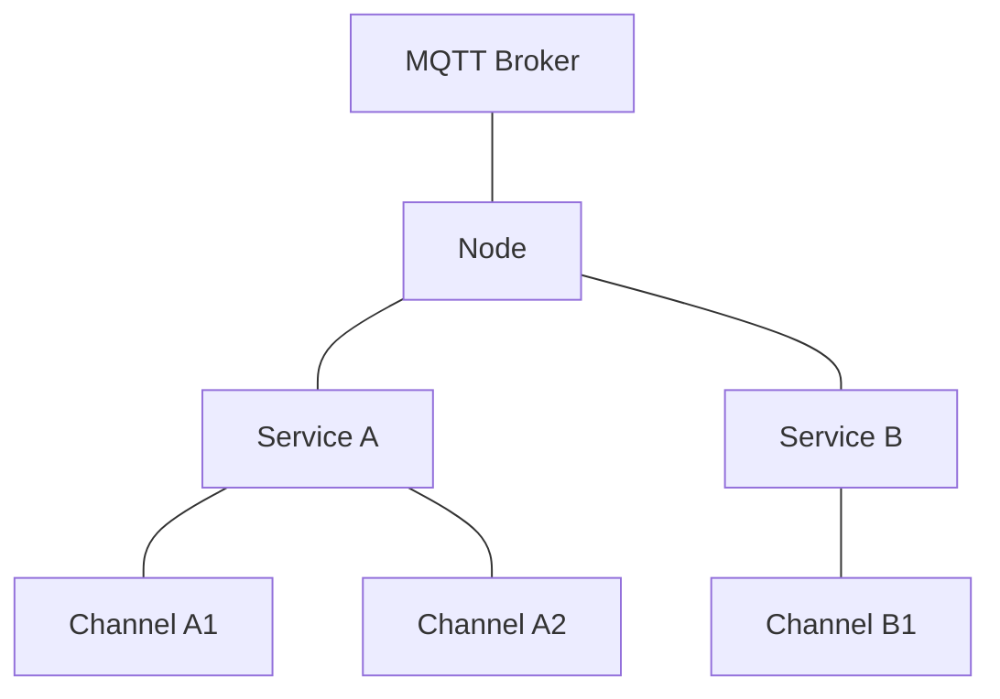
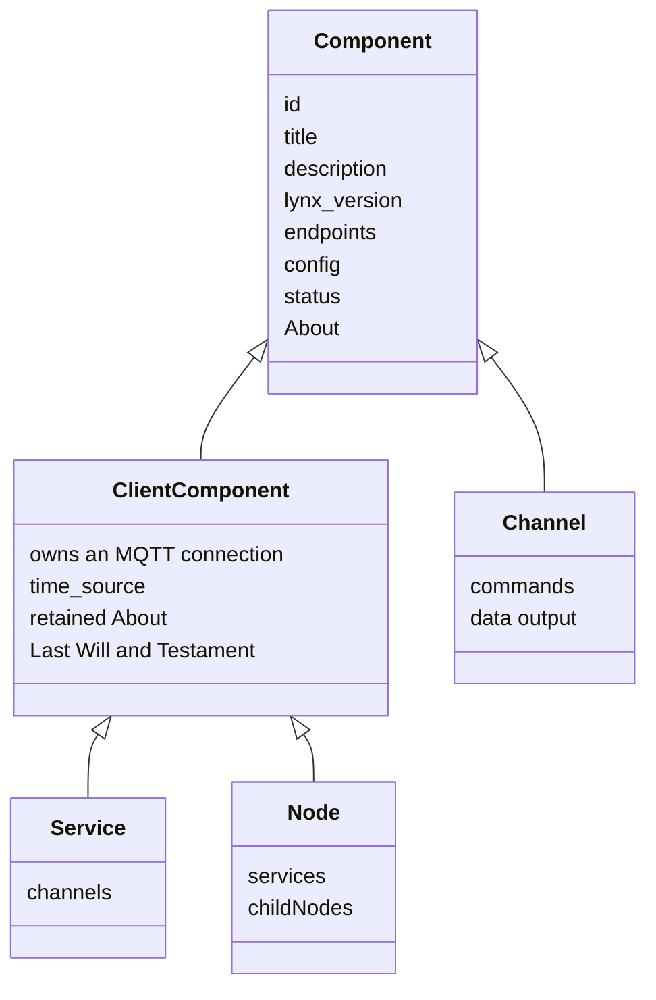
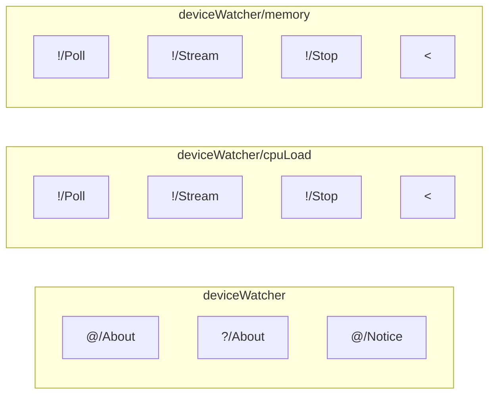
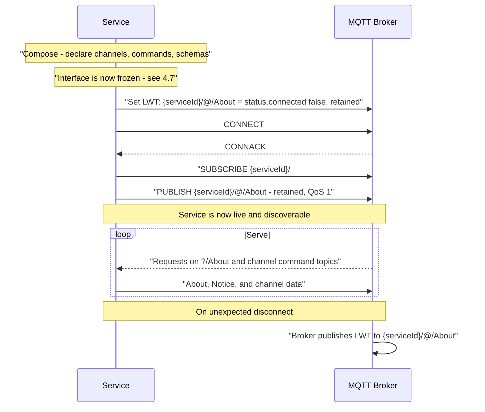
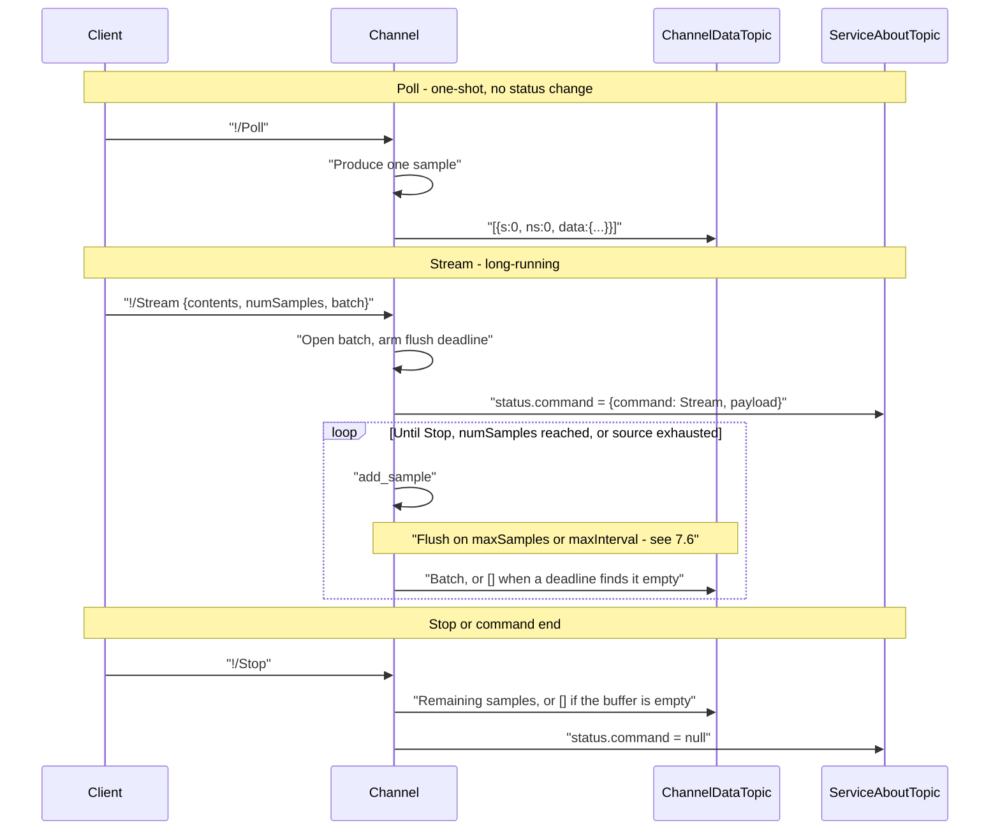
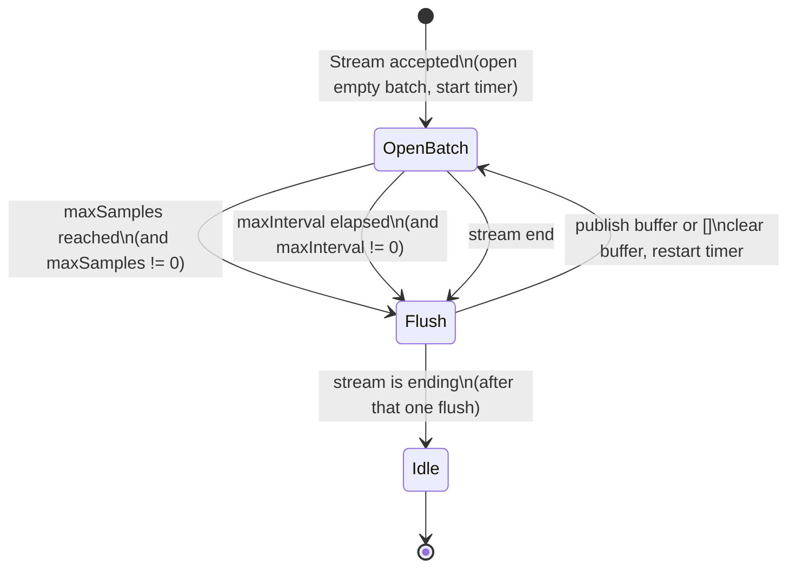
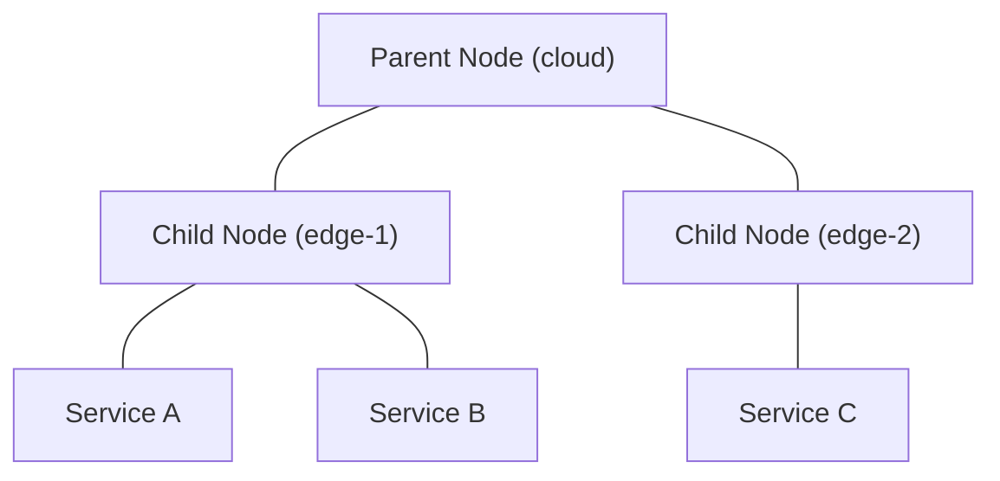
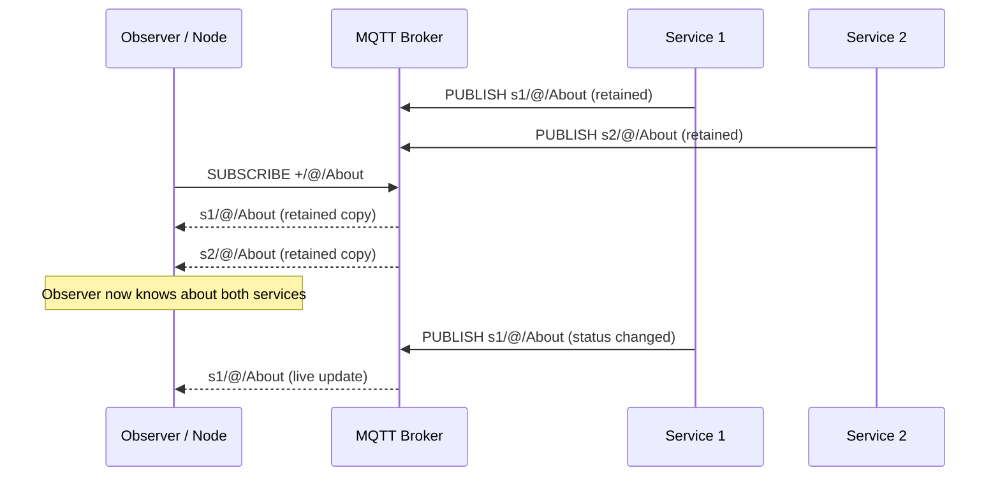

<!-- Generative AI was used in the Creation/Modification of this file -->

# The Lynx Protocol

**Version: A2.1**

---

## 1. Introduction

Lynx is a **Lightweight Network Extension of MQTT**. It defines a set of conventions on top of standard MQTT that give sensor networks self-describing services, structured data channels, automatic discovery, and schema-validated payloads -- all without replacing MQTT or requiring a custom broker.

Any standard MQTT client can participate in a Lynx network. Lynx simply defines *how* topics are named, *what* payloads look like, and *which* topics carry special meaning. The result is a network where every service advertises what it is, what data it produces, and what commands it accepts -- and where observers can discover and monitor the entire topology automatically.

### Design Philosophy

- **Minimal complexity.** Lynx adds structure to MQTT, not a new transport. If you know MQTT, you already know most of Lynx.
- **Self-describing.** Every Lynx component publishes an "About" payload that fully describes its identity, capabilities, endpoints, and current status.
- **Schema-enforced.** Payloads are JSON validated against JSON Schema (Draft 7), so producers and consumers agree on shape at protocol level.
- **Composable.** Services contain Channels; Nodes connect Services and other child Nodes. The hierarchy is simple and extensible.

---

## 2. Overview

Lynx organizes an MQTT broker into a layered hierarchy of **Nodes**, **Services**, and **Channels**.



| Layer | Role |
|-------|------|
| **Node** | Broker-adjacent coordinator. Monitors connected Services and child Nodes, maintains a NetworkState tree. |
| **Service** | Application boundary. Owns an MQTT client, a time source, and one or more Channels. Publishes a retained self-description. |
| **Channel** | Single data stream. Accepts commands (`Poll`, `Stream`, `Stop`, or application-defined) and publishes timestamped sample arrays. |

A Lynx network can run with just a Service connected to any MQTT broker -- Nodes are optional. Any vanilla MQTT client can subscribe to Lynx topics and consume the JSON payloads directly.

---

## 3. Use Cases

### 3.1 Ideal Fits

- **Sensor networks and device telemetry.** A Raspberry Pi publishing CPU load, temperature, and memory stats. An embedded device reporting accelerometer readings. Lynx's Channel abstraction maps naturally to periodic or event-driven sensor data.
- **Edge monitoring and fleet dashboards.** Nodes at the edge track which Services are alive, their status, and their channel states -- forming a real-time topology view.
- **Schema-enforced IoT data pipelines.** Every Channel declares its output schema. Consumers know the shape of the data before the first sample arrives.
- **Self-describing, discoverable service networks.** No external service registry needed. Subscribe to `+/@/About` and the network describes itself.
- **Rapid prototyping.** Define a Service, attach a Channel with a data source, start it. Data flows in seconds.
- **Lightweight data acquisition (DAQ) systems.** Stream parameters (`sampleInterval`, `numSamples`, `batch`) give fine-grained control over sampling rate and how samples are grouped into published messages.

### 3.2 Non-Ideal Fits

- **No TCP/IP network available.** Lynx is built on MQTT which requires TCP/IP. Additionally an MQTT broker or Lynx Node is required.
- **Heavy computation inside sampling loops.** CPU-bound or long-blocking work in a Channel's data source delays sample production. Batch flushes (including empty keepalives and the stream-end flush) MUST proceed independently of the source, but a blocked source still cannot produce new samples until it returns.
- **Non-JSON / binary payloads.** Lynx payloads are JSON objects. Large binary data (images, video, raw ADC buffers) would need base64 encoding or an out-of-band mechanism.
- **Very large-scale deployments (1k+ devices).** Every Service publishes a retained `@/About` message. At extreme scale, the broker's retained message store and the wildcard subscription `+/@/About` may become bottlenecks.
- **RPC-heavy / request-response architectures.** Lynx is oriented around pub/sub data streams, not request-response patterns. While `?/About` is a query-response pattern, Channels are one-directional output streams.

---

## 4. Core Concepts

### 4.1 Component

The base entity in Lynx. Every Component has:

- **Identity**: `id`, `title`, `description`, `lynx_version`
- **Endpoints**: a set of MQTT topics it publishes to or subscribes on
- **Status**: an object describing mutable runtime status (`connected` for Services/Nodes; `command` for Channels)
- **About**: a method to produce a full self-description as a JSON object

### 4.2 Component Types

The diagram below describes protocol roles, not the classes of any particular SDK. It names only what is observable on the wire.



- **Service** and **Node** are *client components* -- they own an MQTT connection, and so have a `connected` status and a Last Will. A Channel does not; it is reached through its parent Service's topic namespace.
- A Service contains zero or more Channels. A Node monitors zero or more Services and child Nodes.
- A Channel's endpoint set is not fixed. See section 7.1.

How an implementation arranges these roles internally -- which objects hold the MQTT client, which own scheduling, whether a Channel is one class or several -- is outside the scope of this specification.

### 4.3 Endpoints

An Endpoint is a single MQTT topic with:
- A **direction**: `sub` (subscribes and handles incoming messages), `pub` (publishes outgoing messages), or `pubsub`.
- A **payload schema**: a complete JSON Schema (Draft 7) object describing the expected payload. See section 4.6 for the canonical form and the requirement that the advertised schema be the enforced one.
- A **description**: human-readable purpose.

### 4.4 About

Every component can produce an "About" payload -- a JSON object that fully describes the component. Services and Nodes publish their About as a **retained** MQTT message so that new subscribers immediately receive the current state of the network.

### 4.5 Contents

A filtering mechanism that lets consumers request only the parts of a payload they care about. The `contents` parameter appears on `?/About` queries and on channel Poll/Stream commands. It supports several modes:

| `contents` value | Behavior |
|------------------|----------|
| `true` (or omitted) | Return the full payload. |
| `{}` | Select no keys. Returns an empty object. When nested (e.g. `"channels": {}`), the parent key is kept with an empty object value. |
| `false` | Return only values that changed since the last sample (change-of-value). |
| `{"key1": true, "key2": false}` | Select specific keys; per-key `true`/`false` controls inclusion or change-of-value. |
| `"<xxh32 hex string>"` | Return the payload only if its xxh32 hash differs from the provided hash. |

### 4.6 Endpoint Metadata

Each endpoint in a component's About is keyed by its full MQTT topic string and contains the following fields:

| Field | Type | Required | Applies to | Description |
|-------|------|----------|------------|-------------|
| `endpoint_direction` | string | yes | all | `"sub"`, `"pub"`, or `"pubsub"`. |
| `description` | string | no | all | Human-readable purpose of the endpoint. |
| `payload_schema` | object | no | all | Complete JSON Schema (Draft 7) object describing the payload shape (see below). |
| `additionalProperties` | boolean | no | all | Present when `payload_schema` is present. Mirrors the schema's own `additionalProperties` (see below). |
| `replyTopics` | array of strings | no | InEndpoints only | Nominal non-data reply topics (see below). |
| `dataOutput` | boolean | no | Channel InEndpoints only | Whether this endpoint may publish to the channel's `<` topic (see below). |

#### `payload_schema`

`payload_schema` MUST be a complete JSON Schema (Draft 7) object -- one carrying a `type` keyword and, for object payloads, a `properties` map. A bare map of property names to subschemas is **not** valid:

```json
"payload_schema": {
  "contents": { "type": ["object", "boolean"], "default": true }
}
```

A Draft-7 validator sees no recognized keywords in the object above, treats it as the empty schema, and accepts any payload whatsoever. The correct form is:

```json
"payload_schema": {
  "type": "object",
  "properties": {
    "contents": { "type": ["object", "boolean"], "default": true }
  },
  "additionalProperties": false
}
```

**The advertised schema MUST be the enforced schema.** A component MUST validate payloads against exactly the schema it publishes in About. An implementation that accepts an authoring shorthand internally MUST normalize it to canonical form before publishing, and MUST validate against the normalized form, so that a consumer applying the advertised schema reaches the same accept/reject decision as the component itself.

`$schema` MAY be included and, when present, MUST be `"http://json-schema.org/draft-07/schema#"`.

#### `additionalProperties`

Whether unrecognized keys are accepted is part of an endpoint's contract, so it MUST be observable. When `payload_schema` declares a top-level `additionalProperties`, the endpoint metadata MUST carry the same value alongside it. For object payloads an implementation MUST declare it, defaulting to `false`.

The field is omitted for payloads that are not objects. The channel data topic `<` is the one built-in case: its payload is an array, `additionalProperties` has no meaning at the top level of an array schema, and the constraint that matters is carried by `items` instead.

#### `replyTopics`

Declares the set of MQTT topics that each receive exactly **one** message in the nominal (non-error) flow of this endpoint. The array is **unordered**. Each entry must be a complete, absolute MQTT topic (e.g. `deviceWatcher/@/About`) -- wildcards (`+`, `#`) are not permitted.

Three-state semantics:

| Value | Meaning |
|-------|---------|
| *(omitted)* | The endpoint makes no declaration about replies. |
| `[]` (empty array) | The endpoint explicitly has no nominal reply. |
| `["topic1", ...]` | Each listed topic receives one message in the nominal flow. |

`replyTopics` only appears on InEndpoints (endpoints with `endpoint_direction` of `"sub"` or `"pubsub"`). OutEndpoints (direction `"pub"`) do not carry this field. The channel data topic (`<`) is never listed in `replyTopics` -- data output is signaled exclusively via `dataOutput`.

**Design note -- cross-component topics (allowed):** Entries may reference topics outside the declaring component's namespace. This enables aggregators and orchestrators to declare replies on other services' topics. The tradeoff is that consumers cannot assume replies stay within the advertiser's topic tree, and About validation cannot verify topic ownership.

**Design note -- no wildcards (disallowed):** Restricting entries to concrete topics keeps the "one message per listed topic" guarantee well-defined and avoids match-count ambiguity. The tradeoff is that reply sets like "every child's `@/About`" cannot be expressed compactly; each topic must be listed individually.

#### `dataOutput`

Declares whether an InEndpoint may cause data payloads to be published to the channel's data topic (`<`). This field is only valid on **Channel InEndpoints** (endpoints declared under a channel's About).

Three-state semantics:

| Value | Meaning |
|-------|---------|
| *(omitted)* | The endpoint makes no declaration about data output. |
| `true` | This endpoint may publish data payloads to the channel's `<` topic. |
| `false` | This endpoint explicitly does not publish data to `<`. |

Setting `dataOutput: true` is invalid if the channel does not have a `<` endpoint.

OutEndpoints (`<`, `@/About`, `@/Notice`) never carry `dataOutput`.

### 4.7 Interface Stability

A component's **interface** is its set of endpoints together with their metadata: directions, payload schemas, `additionalProperties`, `replyTopics`, and `dataOutput`. In About terms, it is everything under `endpoints` -- including the `endpoints` of each Channel -- as distinct from the mutable `config` and `status`.

**A component's interface MUST NOT change after its first `@/About` publish.** Endpoints may not be added or removed, and schemas may not be altered, for the lifetime of that component's connection.

This rule exists because `@/About` is retained (section 10.1). A consumer may hold a cached copy of an interface it received from the broker's retained store minutes or hours earlier, with no notification that anything changed. Interfaces that mutate after announcement cannot be cached, which would defeat retained About as a discovery mechanism.

Implementations that let an application compose Channel commands or attach data sources therefore MUST require that composition to be complete before connecting. Any attempt to alter the interface after the first About publish MUST fail rather than silently republish a different interface.

`config` and `status` are explicitly **not** part of the interface and are expected to change at runtime. Partial About updates that carry only `status` (section 10.5) do not violate this rule.

---

## 5. Topic Structure

Lynx uses symbolic prefixes in topic segments to distinguish system topics from data topics. The general pattern is:

```
{serviceId}/{channelId?}/{prefix}/{action}
```

### 5.1 Symbolic Prefixes

| Prefix | Name | Meaning | Example |
|--------|------|---------|---------|
| `@` | System | Published by the component automatically (About, Notice) | `deviceWatcher/@/About` |
| `?` | Query | Subscribe to receive a query; response published on `@` | `deviceWatcher/?/About` |
| `!` | Command | Channel commands: the built-ins `Poll`, `Stream`, `Stop`, or application-defined actions | `deviceWatcher/cpuLoad/!/Stream` |
| `<` | Output | Channel data output | `deviceWatcher/cpuLoad/<` |

### 5.2 Topic Tree Example

For a service `deviceWatcher` with channels `cpuLoad` and `memory`:



The full topic strings for this service are:

| Topic | Direction | QoS | Retained | Purpose |
|-------|-----------|-----|----------|---------|
| `deviceWatcher/@/About` | pub | 1 | yes | Service self-description |
| `deviceWatcher/?/About` | sub | -- | -- | Query service info |
| `deviceWatcher/@/Notice` | pub | 1 | no | Log/alert messages |
| `deviceWatcher/cpuLoad/!/Poll` | sub | -- | -- | Produce one sample immediately |
| `deviceWatcher/cpuLoad/!/Stream` | sub | -- | -- | Start continuous sampling |
| `deviceWatcher/cpuLoad/!/Stop` | sub | -- | -- | End the active command |
| `deviceWatcher/cpuLoad/<` | pub | 0 | no | Sample data output |
| `deviceWatcher/memory/!/Poll` | sub | -- | -- | Produce one sample immediately |
| `deviceWatcher/memory/!/Stream` | sub | -- | -- | Start continuous sampling |
| `deviceWatcher/memory/!/Stop` | sub | -- | -- | End the active command |
| `deviceWatcher/memory/<` | pub | 0 | no | Sample data output |

Both Channels above happen to expose the same commands. That is a property of this example, not a rule: Channel interfaces are composed per Channel (section 7.1), so a third Channel in the same Service might expose only `!/Stream`, `!/Stop`, and `<`, or might add an application-defined command such as `!/Calibrate`.

### 5.3 Topic Construction Rules

- **Service endpoints**: `{serviceId}/{prefix}/{action}` -- e.g., `deviceWatcher/@/About`
- **Channel endpoints**: `{serviceId}/{channelId}/{prefix}/{action}` -- e.g., `deviceWatcher/cpuLoad/!/Stream`
- **Node endpoints**: the Node's own About uses `{nodeId}/@/About`, but the monitor endpoint subscribes to `+/@/About` (a wildcard that catches all direct children).

Component and channel IDs, and command actions, each occupy exactly one topic segment: they MUST NOT be empty, MUST NOT contain `/`, and MUST NOT contain the MQTT wildcards `+` or `#`.

---

## 6. Services

A Service is the primary application-level component in Lynx. It represents a single program or device that connects to the broker, publishes data through Channels, and describes itself via About.

### 6.1 Service Endpoints

Every Service automatically creates three endpoints:

**`{serviceId}/@/About`** (pub, QoS 1, retained)
Publishes the full self-description on connect and whenever state changes.

**`{serviceId}/?/About`** (sub)
Receives queries. When a message arrives, the Service produces its About, optionally trims it by the `contents` parameter in the request, and publishes a single message to `@/About`. This is declared via `replyTopics: ["{serviceId}/@/About"]`.

**`{serviceId}/@/Notice`** (pub, QoS 1, not retained)
Publishes log-level notices (DEBUG through CRITICAL) as structured JSON.

### 6.2 About Payload

The `@/About` payload for a Service looks like this. `?/About` is shown with its schema in full; elsewhere `payload_schema` bodies are abbreviated as `{ ... }` for readability. Note that `{}` is a *valid* schema meaning "accept anything", so it is never used as an elision marker.

```json
{
  "lynxType": "Service",
  "docs": {
    "id": "deviceWatcher",
    "title": "Device Watcher",
    "description": "Watches the device running this service and publishes statistics.",
    "lynx_version": "A2.1",
    "time_source": "unix"
  },
  "config": {},
  "status": {
    "connected": true
  },
  "endpoints": {
    "deviceWatcher/@/About": {
      "endpoint_direction": "pub",
      "description": "Publish information about the Component.",
      "payload_schema": { ... },
      "additionalProperties": false
    },
    "deviceWatcher/?/About": {
      "endpoint_direction": "sub",
      "description": "Query information about the Component.",
      "payload_schema": {
        "$schema": "http://json-schema.org/draft-07/schema#",
        "type": "object",
        "properties": {
          "contents": {
            "title": "contents Object",
            "description": "Omit or true for the full payload. An empty object {} selects no keys.",
            "type": ["object", "boolean"],
            "default": true
          }
        },
        "additionalProperties": false
      },
      "additionalProperties": false,
      "replyTopics": ["deviceWatcher/@/About"]
    },
    "deviceWatcher/@/Notice": {
      "endpoint_direction": "pub",
      "description": "Publish a notice about the Component.",
      "payload_schema": { ... },
      "additionalProperties": false
    }
  },
  "channels": {
    "cpuLoad": {
      "lynxType": "Channel",
      "docs": { "id": "cpuLoad", "title": "CPU Load", "description": "Polls the CPU load", "lynx_version": "A2.1" },
      "config": {},
      "status": {
        "command": null
      },
      "endpoints": {
        "deviceWatcher/cpuLoad/!/Poll": {
          "endpoint_direction": "sub",
          "description": "Produce one sample immediately.",
          "payload_schema": { ... },
          "additionalProperties": false,
          "replyTopics": [],
          "dataOutput": true
        },
        "deviceWatcher/cpuLoad/!/Stream": {
          "endpoint_direction": "sub",
          "description": "Start streaming on the channel, emitting data when available.",
          "payload_schema": { ... },
          "additionalProperties": false,
          "replyTopics": ["deviceWatcher/@/About"],
          "dataOutput": true
        },
        "deviceWatcher/cpuLoad/!/Stop": {
          "endpoint_direction": "sub",
          "description": "Stop the active command on the channel.",
          "payload_schema": { ... },
          "additionalProperties": false,
          "replyTopics": ["deviceWatcher/@/About"],
          "dataOutput": false
        },
        "deviceWatcher/cpuLoad/<": {
          "endpoint_direction": "pub",
          "description": "Output data from the channel.",
          "payload_schema": { ... },
          "additionalProperties": false
        }
      }
    }
  }
}
```

This Channel happens to expose all three built-in commands. That is not guaranteed; see section 7.1.

Key sections:

| Section | Mutability | Description |
|---------|-----------|-------------|
| `lynxType` | Immutable | Always `"Service"` for a Service. |
| `docs` | Immutable | Identity metadata: `id`, `title`, `description`, `lynx_version`, `time_source`. |
| `config` | Mutable | Runtime configuration. Application-defined. |
| `status` | Mutable | Current `connected` state. |
| `endpoints` | Immutable | Map of topic string to endpoint metadata (direction, schema, `additionalProperties`, description, and optional `replyTopics` / `dataOutput`). Fixed once announced; see section 4.7. |
| `channels` | Mixed | Map of channel ID to channel About (each channel has its own docs/config/status/endpoints). The set of channels and their endpoints is immutable; their `config` and `status` are not. |

### 6.3 Service Lifecycle

A Service passes through three phases: **compose**, during which its interface is defined; **announce**, which connects and publishes About; and **serve**, during which it handles requests and produces data.



The interface MUST be complete before the About publish, and MUST NOT change afterwards (section 4.7). Everything a Service will ever advertise is therefore settled during compose.

**Execution ownership is out of scope.** This specification does not say what drives the serve phase. An implementation MAY own a thread and block the caller, MAY integrate with an application's existing event loop, or MAY require the application to call into it periodically. What matters is only that the obligations defined elsewhere are met on time: batch flush deadlines (section 7.6), MQTT keepalive, and prompt handling of `!/Stop`. A component that cannot meet them because nothing is servicing its runtime is non-conformant regardless of how it is scheduled.

### 6.4 Broker Resolution

When a Service (or Node) starts, it resolves the broker address in this priority order:

1. Environment variables `UPSTREAM_NODE_HOST` / `UPSTREAM_NODE_PORT`
2. `lynxConf.json` file in the working directory (`UpstreamNodeHost` / `UpstreamNodePort`)
3. Default: `localhost:1883`

### 6.5 Python SDK Example

```python
from lynx_sdk import Service

service = Service(
    id="deviceWatcher",
    title="Device Watcher",
    description="Watches the device running this service and publishes statistics.")

# ... add channels ...

if __name__ == "__main__":
    service.start()
```

---

## 7. Channels

A Channel is the data path within a Service. It encapsulates a single input/output data stream: a set of commands that clients may invoke, and structured output on `<`.

### 7.1 Channel Interfaces

A Channel's endpoint set is **derived from the capabilities it declares**, not fixed by this specification. Two Channels in the same Service may expose different commands, and a Channel may expose commands this specification does not define (section 7.3).

Through A2.0, every Channel was required to expose `!/Poll`, `!/Stream`, `!/Stop`, and `<`. That guarantee is withdrawn, because not every data source can satisfy every command. A Channel fed by an application that pushes samples as events occur cannot produce a reading on demand, so advertising `!/Poll` would promise something it cannot deliver. Rather than have such a Channel accept Poll and answer with a stale or synthetic value, A2.1 has it omit the endpoint.

**Consumers MUST read a Channel's About before invoking commands on it.** A client MUST NOT assume `!/Poll` or `!/Stream` exists on one Channel because it exists on another. Publishing to a command topic a Channel does not advertise has no defined effect: the Channel is not obliged to respond, and MAY emit a Notice (section 11).

#### Required structure

Composition is constrained. Every Channel MUST satisfy all of the following:

| Rule | Rationale |
|------|-----------|
| At least one command endpoint under `!/` | A Channel with no commands cannot be interacted with, and conveys nothing that Service-level About does not already carry. |
| A `<` endpoint if and only if some command declares `dataOutput: true` | Section 4.6 already forbids `dataOutput: true` without `<`. The converse prevents advertising a data topic that nothing can ever publish to. |
| `!/Stop` if any command may remain active across messages | Without Stop, a long-running command could only be ended by the Channel itself, leaving the client no way to reclaim it. |
| `!/Stop` only if some command may remain active | Stop would otherwise have nothing to act upon. |

A Channel with no `<` endpoint is legal: a Channel may exist solely to accept commands that act on a device and acknowledge on other topics via `replyTopics`.

Interfaces are fixed once announced; see section 4.7.

#### Discovering a Channel's capabilities

Everything a client needs is already in the Channel's About:

- **Which commands exist** -- the keys under `endpoints` containing an `!/` segment.
- **What each accepts** -- that endpoint's `payload_schema`. A command that omits a parameter does not support it. A Channel supporting `contents` but not `sampleInterval` advertises a `!/Stream` schema whose `properties` contain the former and not the latter (section 7.5).
- **Which produce data** -- `dataOutput`.
- **What else each replies on** -- `replyTopics`.

Because `additionalProperties` is `false` by default (section 4.6), sending an unsupported parameter is a validation failure rather than a silently ignored field. Clients can therefore rely on schema absence meaning genuine absence.

### 7.2 Built-in Commands

Three command names have protocol-defined meanings. A Channel MUST NOT use these names for other purposes, though it need not implement any of them.

| Endpoint | Direction | `replyTopics` | `dataOutput` | Purpose | Required |
|----------|-----------|---------------|--------------|---------|----------|
| `{serviceId}/{channelId}/!/Poll` | sub | `[]` | `true` | Produce one sample immediately | no |
| `{serviceId}/{channelId}/!/Stream` | sub | `["{serviceId}/@/About"]` | `true` | Begin continuous sampling | no |
| `{serviceId}/{channelId}/!/Stop` | sub | `["{serviceId}/@/About"]` | `false` | End the active command | conditional (7.1) |
| `{serviceId}/{channelId}/<` | pub | -- | -- | Data output (array of timestamped samples) | conditional (7.1) |

**`!/Poll`** produces exactly one sample and publishes it as a one-element array on `<`, with `s` and `ns` both `0`. Poll does not set `status.command`, because it completes within the handling of its request. A Channel MUST NOT advertise `!/Poll` unless it can produce a sample on demand at the moment the request arrives.

**`!/Stream`** begins a long-running command. It sets `status.command`, opens a batch, and publishes on `<` according to the batching rules in section 7.6 until it is stopped, reaches `numSamples`, or its data source is exhausted.

**`!/Stop`** ends whatever command is currently active, flushes once, and clears `status.command`. Stop on an idle Channel is a no-op and MUST NOT produce a data message.

#### Lifecycle



### 7.3 User-Defined Commands

A Channel MAY declare command endpoints beyond the built-ins of section 7.2 -- `!/Calibrate`, `!/Tare`, `!/Reset` -- and describe them with the same metadata every other endpoint uses. No extension mechanism is needed: `replyTopics` and `dataOutput` were defined in A2.0 as general endpoint fields, so a user-defined command is already fully describable. A2.1 only makes the permission explicit, since A2.0's fixed four-endpoint table implied a closed set.

**Naming.** A command topic is `{serviceId}/{channelId}/!/{Action}`. `{Action}` MUST be a single non-empty topic segment: no `/`, and no MQTT wildcards (`+`, `#`). Actions SHOULD be PascalCase for consistency with the built-ins. Action names are case-sensitive and MUST be unique within a Channel.

**Reserved names.** `Poll`, `Stream`, and `Stop` are reserved with the meanings given in section 7.2. To leave room for future built-ins without breaking deployed services, user-defined actions SHOULD NOT be single common verbs likely to be standardized later -- `Start`, `Pause`, `Resume`, `Reset`, `Configure`. Prefixing an application-specific action, as in `!/AcmeCalibrate`, avoids collision entirely. Future versions of this specification will only add built-ins in the reserved style described here, and will list any additions in Appendix B.

**Metadata obligations.** A user-defined command is an InEndpoint, so:

- It MUST declare a `payload_schema` in canonical form (section 4.6), even if that schema is the empty-object form used by `!/Stop`.
- It SHOULD declare `replyTopics`, using `[]` to state explicitly that it has no nominal reply.
- It MUST declare `dataOutput` if it may publish to `<`, and doing so requires the Channel to have a `<` endpoint.

**Long-running user-defined commands.** A user-defined command MAY be long-running, in which case it MUST set `status.command` with its own action name in the `command` field:

```json
{ "command": "Calibrate", "payload": { "reference": 100.0 } }
```

It is then subject to the same rules as `!/Stream`: the Channel MUST expose `!/Stop`, `!/Stop` MUST end it, and it counts as the Channel's one active command under section 7.7. A command that completes within the handling of its request MUST NOT set `status.command`, matching `!/Poll`.

### 7.4 Output Format

Channel output is always a **JSON array** of sample objects. The array MAY be empty (`[]`).

```json
[
  {
    "s": 0,
    "ns": 0,
    "data": {
      "load": 23.5
    }
  },
  {
    "s": 1,
    "ns": 42000000,
    "data": {
      "load": 31.2
    }
  }
]
```

| Field | Type | Description |
|-------|------|-------------|
| `s` | integer | Seconds elapsed since the start of the current stream/poll |
| `ns` | integer | Nanoseconds remainder (0 to 999,999,999) |
| `data` | object | The sample data, validated against the `<` endpoint's `payload_schema` |

Timestamps are **relative to the start of the current stream** (or zero for a Poll), measured via a high-resolution performance counter. They do **not** reset when a batch is published -- every sample in every batch of a stream shares the same origin (see section 9.2).

An empty array `[]` is a valid data message. It is published when a batch flush occurs with no samples in the buffer (a keepalive / idle window, or a stream-end flush of an empty buffer). `[]` is **not** an end-of-stream marker -- consumers detect stream end from `status.command` becoming `null` on About.

### 7.5 Stream Parameters

These are the parameters `!/Stream` may accept. **Each is optional for the Channel to support.** A Channel advertises exactly the ones it implements in its `!/Stream` `payload_schema`; a parameter absent from that schema is not merely ignored but rejected, since `additionalProperties` defaults to `false` (section 4.6). Omitted fields in an otherwise-valid request use the defaults below.

| Parameter | Type | Default | Description |
|-----------|------|---------|-------------|
| `contents` | object \| boolean | `true` | Filter which keys to include in output data (see section 7.8). Omit or `true` for all; `{}` selects no keys. |
| `sampleInterval` | number | `1.0` | Minimum seconds between samples admitted to a batch. `0` = admit every sample the source offers. Binding when advertised; see below. |
| `numSamples` | integer | `0` | Total samples to admit into batches. `0` = infinite, `n` = end the command after n admitted samples. |
| `batch` | object | see below | Flush limits for the open batch. Omitted `batch`, or omitted fields inside it, uses the field defaults. |

**`batch` object:**

| Field | Type | Default | Description |
|-------|------|---------|-------------|
| `maxInterval` | number | `300` | Max seconds an open batch may wait before it is published. `0` = no time limit (time-based flush disabled, including empty keepalives). |
| `maxSamples` | integer | `1` | Max samples in one published message. `0` = no count limit. |

`!/Poll` accepts only `contents`, and only if the Channel supports it. Poll is always one sample in one message, so `sampleInterval`, `numSamples`, and `batch` are meaningless there and MUST NOT be advertised on it.

#### `sampleInterval` is binding when advertised

A Channel that advertises `sampleInterval` MUST honor it: between one admitted sample and the next, at least `sampleInterval` seconds MUST elapse. Samples offered sooner MUST be discarded, exactly as `contents`-trimmed empties are discarded (section 7.6) -- they do not enter the batch and do not count toward `batch.maxSamples` or `numSamples`.

This is a change from A2.0, which described `sampleInterval` as a request the Channel could disregard. An advertised-but-unhonored parameter is worse than an absent one: a client asking for 1 Hz and receiving 1 kHz has no way to detect the discrepancy from About, and sizes its buffers wrongly. A Channel that cannot control its own sample cadence MUST omit the parameter instead, which tells the client to expect data at whatever rate the source produces it.

Enforcement is a property of the Channel, not of any particular data source. Where a Channel pulls from a source it drives, honoring `sampleInterval` may amount to waiting between reads; where a Channel receives samples pushed by an application, honoring it means discarding those that arrive too soon. Both are the same rule.

`sampleInterval` bounds the interval between admitted samples and nothing else. It does not bound publish cadence, which is governed independently by `batch` (section 7.6).

Example -- high-rate DAQ, flush on count or time:

```json
{
  "sampleInterval": 0.001,
  "batch": {
    "maxInterval": 0.1,
    "maxSamples": 1000
  }
}
```

Up to 1000 samples per message, or a flush every 0.1 s, whichever happens first. If 0.1 s elapses with nothing in the buffer, the channel publishes `[]`.

### 7.6 Batching

Sampling and batching are **separate operations**. A Stream maintains one **open batch** (a buffer of samples not yet published) and a **batch timer**. Implementations MUST honor the flush rules below even if the data source is blocked or slow. How the runtime is scheduled -- an SDK-owned thread, an application event loop, a manual poll -- is out of band; the operations and their triggers are not.



#### Operations

| Operation | When | Effect |
|-----------|------|--------|
| **start_stream** | `!/Stream` accepted | Set `status.command`. Open an empty batch. Start the batch timer. Begin admitting samples. |
| **add_sample** | The data source offers a sample | Apply the admission rules below. If the sample is discarded, it does not enter the batch and does not count toward `batch.maxSamples` or `numSamples`. Otherwise append it with stream-relative `s`/`ns`. If `maxSamples > 0` and the buffer length is now `>= maxSamples`, **flush**. If `numSamples > 0` and admitted samples now equal `numSamples`, **end_stream**. |
| **on_max_interval** | `maxInterval > 0` and that many seconds have elapsed since the timer started or last reset | **flush**, even if the buffer is empty. MUST fire independently of the data source. |
| **flush** | Any trigger above | Publish the buffer to `<` as a JSON array. If the buffer is empty, publish `[]`. Clear the buffer. If the stream is still active, restart the batch timer. The stream-end flush does not open a new batch. |
| **end_stream** | `!/Stop`, `numSamples` reached, or the data source is exhausted | **flush** once (including `[]` if the buffer is already empty). Set `status.command` to `null`. |

#### Admission rules

`add_sample` applies these in order, and any of them may discard the offered sample:

1. **Rate.** If the Channel advertises `sampleInterval` and fewer than `sampleInterval` seconds have elapsed since the last admitted sample, discard (section 7.5).
2. **Filtering.** If the Channel advertises `contents` and the request supplied a value other than `true`, apply it. If the result is empty, discard (section 7.8).

A discarded sample has no observable effect: it is not published, does not advance `numSamples`, does not fill the batch, and does not reset the rate gate. Only admitted samples update the "last admitted" instant used by rule 1.

These operations on a given channel MUST be serialized: a sample is admitted to exactly one batch, and a flush publishes exactly the samples admitted since the previous flush. `add_sample` and `on_max_interval` must not interleave mid-operation.

The batch timer **starts at Stream start**, before any samples, and **resets on every count, time, or empty flush**. The stream-end flush does not reset it. A new open batch never inherits leftover time from the previous one.

Whichever limit is reached first flushes the current batch. If both would fire at the same instant, publish **one** message, not two.

#### Limit values of `0`

| `maxInterval` | `maxSamples` | Behavior |
|---------------|--------------|----------|
| `> 0` | `> 0` | Flush when either limit is reached (including `[]` on timeout with an empty buffer). |
| `> 0` | `0` | Time-only: flush every `maxInterval` seconds, including `[]` when idle. Count never triggers. |
| `0` | `> 0` | Count-only: flush when the buffer reaches `maxSamples`. No empty keepalives. |
| `0` | `0` | Hold until stream end. One final publish of the entire buffer (or `[]` if nothing was admitted). Unbounded memory if the stream is long. |

#### `numSamples` vs `batch.maxSamples`

- `batch.maxSamples` is per published message.
- `numSamples` is the stream-lifetime cap on samples **admitted into batches** (after `contents` filtering). `0` means no cap.
- Reaching `numSamples` ends the stream (one final flush). It does not change how the open batch flushes before that.

#### Empty arrays are not end-of-stream

`[]` is published whenever a flush runs against an empty buffer: an idle `maxInterval` window, or a final flush after the last count-based publish already emptied the buffer. A stream that ends with samples still buffered publishes those samples and does **not** send an extra trailing `[]`. Consumers MUST use About `status.command`, not `[]`, to detect that a stream has ended.

#### Independence from the data source

`on_max_interval` and `end_stream` (from `!/Stop`) MUST be able to **flush** while the data source is blocked or silent. `add_sample` is the only operation that depends on the source. This keeps batching well-defined regardless of who schedules the runtime: the scheduler is responsible for invoking these operations on time, and the Channel only declares the rules.

An implementation MAY therefore express the `maxInterval` trigger as a **deadline** it exposes rather than a timer it owns, letting a thread, an event loop, or an application's own loop decide how to wait for it. That choice is invisible on the wire and does not affect conformance, provided the flush happens when the deadline passes.

#### Worked examples

**Default-like Stream** (`{}` or omitted `batch`): `sampleInterval=1.0`, `maxInterval=300`, `maxSamples=1`. Each admitted sample publishes immediately as a one-element array. `[]` appears only if nothing is admitted for 300 s (a silent source, or every sample dropped by `contents`).

**High-rate DAQ** (`sampleInterval=0.001`, `maxInterval=0.1`, `maxSamples=1000`): a full batch of 1000 publishes as soon as it fills; otherwise the open batch publishes at 0.1 s. Silence for 0.1 s yields `[]`.

**`numSamples=5`, `maxSamples=1`:** five one-sample messages, then a final `[]` because the fifth flush already emptied the buffer.

**`numSamples=5`, `maxSamples=10`:** five samples accumulate, then stream end flushes those five. No extra `[]`.

### 7.7 Command Concurrency

**At most one command may be active on a Channel at a time.** A command is active from the moment it sets `status.command` until that field returns to `null`. Commands that complete within the handling of their request, such as `!/Poll`, are never active in this sense and are not restricted by this rule.

While a command is active, a Channel receiving a request that would start another long-running command MUST:

- reject the new request,
- leave the active command running and untouched,
- leave `status.command` unchanged, so no About is published,
- publish no data message, not even `[]`, and
- SHOULD emit a Notice at `WARNING` (section 11).

Rejection is silent on the command's own topics. In particular a rejected `!/Stream` produces no message on `<` and no `@/About`, despite `!/Stream` declaring `replyTopics: ["{serviceId}/@/About"]` -- that declaration describes the nominal flow, and a rejection is not the nominal flow.

A client determines whether a Channel is busy by reading `status.command` in About, which is `null` when the Channel is idle and an object naming the active command otherwise. Because `!/Stream` publishes About when it starts and when it ends, a subscriber to `@/About` sees each transition.

`!/Poll` on a busy Channel is a distinct case that this specification does not constrain: Poll does not compete for `status.command`, so a Channel MAY serve it concurrently with an active Stream, or MAY reject it as above. A Channel SHOULD document its behavior in the endpoint's `description`.

**Design note -- one active command (chosen):** A single active command keeps `status.command` a scalar, keeps the batching rules of section 7.6 unambiguous about which batch a sample joins, and gives Stop an unambiguous target. The cost is that a Channel cannot serve two clients streaming at different rates or with different `contents` filters; the second client must wait, or the deployment must expose a second Channel. Fan-out to multiple concurrent Streams per Channel is deliberately excluded from A2.1 and may be revisited, which would require `status.command` to become a collection and Stop to identify its target.

### 7.8 The `contents` Filtering Mechanism

The `contents` parameter provides flexible control over what data is included in channel output and About responses. It operates recursively on the payload:

**Boolean mode:**
- `true` (or omitted) -- include the full payload, no filtering.
- `false` -- change-of-value mode. Only include values that differ from the previous sample.

**Empty object:**
- `{}` -- select no keys. Returns `{}`. When used as a nested rule (e.g. `"channels": {}`), the parent key is kept and its value is `{}` (the full subtree is not included).

**Dict mode:**
```json
{
  "total": true,
  "percent": true,
  "used": false,
  "free": false
}
```
Select specific keys. Each key maps to its own `contents` rule (can nest dicts for deep structures). Keys set to `true` are always included; keys set to `false` use change-of-value. An empty nested rule such as `"channels": {}` keeps the `channels` key with an empty object value.

On a Stream, `contents` is applied **before** a sample enters the open batch. A sample that trims to `{}` is discarded: it is not published, and it does not count toward `batch.maxSamples` or `numSamples`. The same empty-object rule applies at the top level: a Stream with `"contents": {}` admits no samples.

**String mode (xxhash):**
```json
"a3b2c1d0"
```
The string is interpreted as an xxh32 hex digest. The payload is hashed and compared. If it matches, nothing is returned (no change). If it differs, the new hash (or the full payload) is returned.

### 7.9 Data Sources

Where a Channel's samples come from is an implementation concern, not a protocol one. The protocol defines only that samples reach the batch through `add_sample` (section 7.6) and that the Channel's advertised interface reflects what its source can actually do. Two arrangements are common, and both produce identical output on `<`.

**Pulled.** The Channel drives its source, asking for a reading when it needs one. This is the natural fit for a sensor that can be read at any moment. Such a Channel can produce a sample on demand, so it may advertise `!/Poll`, and it can control its own cadence, so it may advertise `sampleInterval`.

**Pushed.** The application offers samples to the Channel as they become available -- an event detector, a frame from a camera, a reading arriving over a serial link. The Channel calls `add_sample` with whatever it is given. When no command is active, offered samples are discarded; they are not published, and they do not accumulate.

The two arrangements differ in advertised interface, not in wire behavior:

| | Pulled | Pushed |
|---|---|---|
| `!/Poll` | MAY advertise | MUST NOT advertise, unless the Channel can satisfy a request at the moment it arrives (7.2) |
| `sampleInterval` | MAY advertise | MAY advertise, and MUST then discard samples offered too soon (7.5) |
| `<` payload | identical | identical |
| `status.command` | identical | identical |

Nothing prevents a Service from containing some Channels of each kind. A pushed Channel that also wishes to answer Poll must be able to produce a value synchronously, which in practice means holding a most-recent sample -- and it should only advertise `!/Poll` if serving a possibly-stale value is acceptable for that data, since Poll's `s` and `ns` are always `0` and carry no age information.

**Timing independence.** The cadence at which samples are admitted and the cadence at which batches are published are independent. A slow or silent source delays `add_sample`; it MUST NOT delay `on_max_interval` or a Stop-driven `end_stream` (section 7.6).

### 7.10 Python SDK Example

**Pulled source, decorator style:**

```python
@service.channel(
    "cpuLoad",
    title="CPU Load",
    description="CPU load of the host",
    output_data_properties={"load": {"type": "number", "unit": "%"}})
def sample_cpu_load(request, continue_sampling):
    while continue_sampling(default_interval=0.5):
        yield {"load": psutil.cpu_percent(interval=0.1)}
```

**Pushed source, driven by the application's own loop:**

```python
motion = service.channel(
    "motion",
    title="Motion Events",
    description="Emits an event whenever motion is detected",
    output_data_properties={"confidence": {"type": "number"}})

# ... elsewhere, in the application's loop ...
motion.add_sample({"confidence": 0.92})   # discarded unless a command is active
```

The `motion` Channel advertises `!/Stream`, `!/Stop`, and `<`, but not `!/Poll`: motion cannot be produced on request.

`service.channel()` is both a factory and a decorator. `@service.channel(...)` attaches the decorated generator as the sample function and binds the name to the Channel; `motion = service.channel(...)` returns a Channel for a pushed source.

---

## 8. Nodes

A Node is a broker-adjacent component that monitors the Lynx network. It tracks which Services are connected, their status, and the status of their Channels. Nodes form the topology layer of Lynx.

### 8.1 Node Endpoints

A Node creates these endpoints:

| Endpoint | Direction | Purpose |
|----------|-----------|---------|
| `{nodeId}/@/About` | pub | Node self-description (retained) |
| `{nodeId}/?/About` | sub | Query node info |
| `{nodeId}/@/Notice` | pub | Log/alert messages |
| `+/@/About` | sub | Wildcard monitor: catch About messages from all direct children |

The `+/@/About` subscription uses the MQTT `+` single-level wildcard to match any component ID at one topic level. This means a Node sees the About messages of all Services and child Nodes connected to the same broker.

### 8.2 Node About Payload

A Node's About extends the base About with `services` and `childNodes`:

```json
{
  "lynxType": "Node",
  "docs": {
    "id": "edgeNode01",
    "title": "Edge Node 01",
    "description": "Monitors sensors on floor 3.",
    "lynx_version": "A2.1",
    "time_source": "unix"
  },
  "config": {},
  "status": {
    "connected": true
  },
  "endpoints": {
    "edgeNode01/@/About": {
      "endpoint_direction": "pub",
      "description": "Publish information about the Component.",
      "payload_schema": { ... },
      "additionalProperties": false
    },
    "edgeNode01/?/About": {
      "endpoint_direction": "sub",
      "description": "Query information about the Component.",
      "payload_schema": { ... },
      "additionalProperties": false,
      "replyTopics": ["edgeNode01/@/About"]
    },
    "edgeNode01/@/Notice": {
      "endpoint_direction": "pub",
      "description": "Publish a notice about the Component.",
      "payload_schema": { ... },
      "additionalProperties": false
    },
    "+/@/About": {
      "endpoint_direction": "sub",
      "description": "Monitor about messages from child nodes and services.",
      "payload_schema": { ... },
      "additionalProperties": true
    }
  },
  "services": {
    "deviceWatcher": {
      "lynxType": "Service",
      "docs": { },
      "status": { "connected": false },
      "channels": { }
    }
  },
  "childNodes": {}
}
```

The `services` and `childNodes` maps are populated automatically as the Node receives About messages on `+/@/About`.

### 8.3 Multi-Node Topology

Nodes can be nested. A parent Node can track child Nodes, each of which tracks their own Services:



Each Node maintains a **NetworkState** -- a hierarchical in-memory model of the network tree beneath it:

```json
{
  "services": {
    "serviceA": { "lynxType": "Service", "status": { "connected": true }, "channels": {} },
    "serviceB": { "lynxType": "Service", "status": { "connected": true }, "channels": {} }
  },
  "childNodes": {
    "childNode1": {
      "services": { },
      "childNodes": { }
    }
  }
}
```

### 8.4 Python SDK Example

```python
from lynx_sdk import Node

node = Node(
    id="exampleNode",
    title="Example Node",
    description="Example Node for Lynx.",
    lynx_version="A2.1")

if __name__ == "__main__":
    node.start()
```

---

## 9. Timestamps

Lynx uses two distinct timestamp mechanisms that serve different purposes.

### 9.1 MQTT v5 User Properties (Publish-Time Stamps)

Every message published by a Lynx component includes MQTT v5 User Properties `s` (seconds) and `ns` (nanoseconds) recording when the message was published according to the component's TimeSource.

These properties are set at the MQTT protocol level and are available on *every* Lynx message (About, Notice, Channel output, etc.).

```
MQTT v5 User Properties:
  s  = "1716580000"
  ns = "123456789"
```

### 9.2 Channel Sample Timestamps (Stream-Relative)

Inside a Channel's output array, each sample carries its own `s` and `ns` fields. These are **relative to the start of the current stream**, measured using a high-resolution performance counter (`time.perf_counter_ns()`).

```json
[
  { "s": 0, "ns": 0,         "data": { "load": 12.3 } },
  { "s": 0, "ns": 500000000, "data": { "load": 14.1 } },
  { "s": 1, "ns": 0,         "data": { "load": 13.7 } }
]
```

This means:
- Sample 1 was taken at stream start (t=0).
- Sample 2 was taken 500ms after stream start.
- Sample 3 was taken 1 second after stream start.

The origin is the start of the Stream, not the start of the current batch. Publishing a batch (including an empty `[]`) does not reset sample `s`/`ns`.

For a Poll, both `s` and `ns` are always `0` (single sample, no relative offset). Empty `[]` messages have no sample timestamps; MQTT v5 User Properties on the publish still record when the message was sent (section 9.1).

### 9.3 TimeSource Variants

| TimeSource | Epoch | Use Case |
|------------|-------|----------|
| `UnixTimeSource` | 1970-01-01 | Standard systems (Linux, Windows, macOS). Uses `time.time_ns()`. |
| `Epoch2000TimeSource` | 2000-01-01 | MicroPython devices where `time.time()` starts at year 2000. Adds the epoch delta automatically. |
| `ProcessPerfTimeSource` | Process start | Devices with no real-time clock. Uses `time.perf_counter_ns()` relative to process start. |

The SDK automatically selects the appropriate TimeSource by checking `time.gmtime(0)`:
- Year 1970 -> `UnixTimeSource`
- Year 2000 -> `Epoch2000TimeSource`
- Other -> `ProcessPerfTimeSource`

---

## 10. Discovery and Network State

### 10.1 Retained About as a Service Registry

When a Service connects, it publishes its full About payload to `{serviceId}/@/About` with `retain=True` and `QoS=1`. This means:

- Any client that subscribes to `{serviceId}/@/About` or `+/@/About` immediately receives the last known state, even if the Service published it hours ago.
- The broker stores exactly one retained About per Service, so the retained message store grows linearly with the number of Services.

This effectively turns the broker into a **service registry** with no additional infrastructure.

### 10.2 Querying with `?/About`

To request a fresh About (or a filtered subset), publish to `{serviceId}/?/About`:

```json
{}
```

Returns the full About. Or with `contents` filtering:

```json
{
  "contents": {
    "status": true,
    "channels": {
      "cpuLoad": {
        "status": true
      }
    }
  }
}
```

Returns only the requested subtree.

### 10.3 Discovery Flow



### 10.4 NetworkState

Nodes (and optionally Services with `track_network_state=True`) maintain a `NetworkState` object. This is a hierarchical dict:

```json
{
  "services": {
    "deviceWatcher": { "lynxType": "Service", "docs": {}, "status": {}, "channels": {} },
    "temperatureSensor": { "lynxType": "Service", "docs": {}, "status": {}, "channels": {} }
  },
  "childNodes": {
    "edgeNode02": {
      "services": {},
      "childNodes": {}
    }
  }
}
```

Every incoming About message on `+/@/About` is parsed, and the component is placed into the appropriate branch based on its `lynxType`:

- `"Service"` -> `services[id]`
- `"Node"` -> `childNodes[id]`

`lynxType` is authoritative. A Node About contains both `services` and `childNodes`, so payload-key sniffing is not a substitute. When `lynxType` is absent, a payload containing `channels` is treated as a Service and a payload containing `childNodes` is treated as a Node.

### 10.5 Last Will and Testament (LWT)

When a Service or Node connects, it sets an MQTT Last Will:

- **Topic**: `{componentId}/@/About`
- **Payload**: `{"status":{ "connected": false }}`
- **QoS**: 1
- **Retain**: true

If the client disconnects unexpectedly, the broker publishes this LWT message. NetworkState handles it as a **partial About update** -- it merges the `status` into the existing entry without replacing the full About.

---

## 11. Notices

Notices are Lynx's structured logging mechanism. They bridge component-level events to MQTT so that observers can monitor health and debug issues remotely.

### 11.1 Notice Payload

Published to `{componentId}/@/Notice` (QoS 1, not retained):

```json
{
  "action": "Stream",
  "severity": "WARNING",
  "message": "Channel 'cpuLoad' is already streaming, ignoring stream start request.",
  "data": {}
}
```

| Field | Type | Description |
|-------|------|-------------|
| `action` | string | The command or query in execution when the notice was published. Empty if not related to a specific action. |
| `severity` | string | One of: `DEBUG`, `INFO`, `WARNING`, `ERROR`, `CRITICAL`. |
| `message` | string | Human-readable notice message. |
| `data` | object | Additional structured data. Often empty. |

### 11.2 Severity Levels

| Severity | Value | Use |
|----------|-------|-----|
| `DEBUG` | 10 | Detailed diagnostic info (connection events, endpoint handling). |
| `INFO` | 20 | General operational messages. |
| `WARNING` | 30 | Unexpected but recoverable situations (duplicate stream request, unknown topic). |
| `ERROR` | 40 | Failures that affect a single operation (payload validation failure, handler exception). |
| `CRITICAL` | 50 | System-level failures. |

### 11.3 Python Logging Bridge

In the Python SDK, the `LoggingNoticeHandler` bridges Python's standard `logging` module to MQTT notices. Any log message at INFO or above is automatically published as a Notice, with the log record's timestamp preserved in the MQTT v5 User Properties.

---

## Appendix A: JSON Schemas

### A.1 Service About (`@/About`)

```json
{
  "$schema": "http://json-schema.org/draft-07/schema#",
  "type": "object",
  "properties": {
    "lynxType": {
      "type": "string",
      "enum": ["Service"],
      "description": "The type of the Lynx Component."
    },
    "docs": {
      "type": "object",
      "properties": {
        "id": { "type": "string", "description": "Unique identifier of the Component." },
        "title": { "type": "string", "description": "Human-readable title." },
        "description": { "type": "string", "description": "Human-readable description." },
        "lynx_version": { "type": "string", "enum": ["A2.1"], "description": "Lynx protocol version." },
        "time_source": { "type": "string", "description": "Time source type (e.g., 'unix', 'process')." }
      }
    },
    "config": {
      "type": "object",
      "description": "Mutable runtime configuration."
    },
    "status": {
      "type": "object",
      "properties": {
        "connected": {
          "title": "Connected",
          "description": "Whether the Service is connected to the Lynx network.",
          "type": "boolean"
        }
      }
    },
    "endpoints": {
      "type": "object",
      "description": "Map of topic string to endpoint metadata.",
      "additionalProperties": {
        "type": "object",
        "properties": {
          "endpoint_direction": { "type": "string", "enum": ["sub", "pub", "pubsub"] },
          "description": { "type": "string" },
          "payload_schema": {
            "type": "object",
            "description": "Complete Draft-7 schema object. Must be the schema the component enforces."
          },
          "additionalProperties": {
            "type": "boolean",
            "description": "Mirrors payload_schema's top-level additionalProperties. Required when payload_schema is present."
          },
          "replyTopics": {
            "type": "array",
            "items": { "type": "string", "minLength": 1 },
            "uniqueItems": true,
            "description": "Unordered complete MQTT topics that each receive one nominal non-data reply. Omitted = undeclared; empty = no nominal reply. InEndpoints only."
          }
        }
      }
    },
    "channels": {
      "type": "object",
      "description": "Map of channel ID to channel About object.",
      "additionalProperties": { "$ref": "#/definitions/channelAbout" }
    }
  },
  "definitions": {
    "channelAbout": {
      "type": "object",
      "properties": {
        "lynxType": { "type": "string", "enum": ["Channel"] },
        "docs": {
          "type": "object",
          "properties": {
            "id": { "type": "string" },
            "title": { "type": "string" },
            "description": { "type": "string" },
            "lynx_version": { "type": "string", "enum": ["A2.1"] }
          }
        },
        "config": { "type": "object" },
        "status": {
          "type": "object",
          "properties": {
            "command": {
              "description": "Active command object, or null when idle.",
              "oneOf": [
                { "type": "null" },
                {
                  "type": "object",
                  "properties": {
                    "command": { "type": "string" },
                    "payload": { "type": "object" }
                  }
                }
              ]
            }
          }
        },
        "endpoints": {
          "type": "object",
          "description": "Map of topic string to channel endpoint metadata.",
          "additionalProperties": {
            "type": "object",
            "properties": {
              "endpoint_direction": { "type": "string", "enum": ["sub", "pub", "pubsub"] },
              "description": { "type": "string" },
              "payload_schema": {
                "type": "object",
                "description": "Complete Draft-7 schema object. Must be the schema the channel enforces."
              },
              "additionalProperties": {
                "type": "boolean",
                "description": "Mirrors payload_schema's top-level additionalProperties. Required when payload_schema is present."
              },
              "replyTopics": {
                "type": "array",
                "items": { "type": "string", "minLength": 1 },
                "uniqueItems": true,
                "description": "Unordered complete MQTT topics that each receive one nominal non-data reply. Omitted = undeclared; empty = no nominal reply. InEndpoints only."
              },
              "dataOutput": {
                "type": "boolean",
                "description": "If true, this InEndpoint may publish payloads to the channel's < topic. Omitted = undeclared; false = explicitly no data output. Invalid if true and the channel has no < endpoint."
              }
            }
          }
        }
      }
    }
  }
}
```

### A.2 Node About (`@/About`)

Extends the Service About schema with `services` and `childNodes`:

```json
{
  "$schema": "http://json-schema.org/draft-07/schema#",
  "type": "object",
  "properties": {
    "lynxType": { "type": "string", "enum": ["Node"] },
    "docs": {
      "type": "object",
      "properties": {
        "id": { "type": "string" },
        "title": { "type": "string" },
        "description": { "type": "string" },
        "lynx_version": { "type": "string", "enum": ["A2.1"] },
        "time_source": { "type": "string" }
      }
    },
    "config": { "type": "object" },
    "status": {
      "type": "object",
      "properties": {
        "connected": {
          "title": "Connected",
          "description": "Whether the Node is connected to the Lynx network.",
          "type": "boolean"
        }
      }
    },
    "endpoints": {
      "type": "object",
      "description": "Map of topic string to endpoint metadata.",
      "additionalProperties": {
        "type": "object",
        "properties": {
          "endpoint_direction": { "type": "string", "enum": ["sub", "pub", "pubsub"] },
          "description": { "type": "string" },
          "payload_schema": {
            "type": "object",
            "description": "Complete Draft-7 schema object. Must be the schema the component enforces."
          },
          "additionalProperties": {
            "type": "boolean",
            "description": "Mirrors payload_schema's top-level additionalProperties. Required when payload_schema is present."
          },
          "replyTopics": {
            "type": "array",
            "items": { "type": "string", "minLength": 1 },
            "uniqueItems": true,
            "description": "Unordered complete MQTT topics that each receive one nominal non-data reply. Omitted = undeclared; empty = no nominal reply. InEndpoints only."
          }
        }
      }
    },
    "services": {
      "type": "object",
      "description": "Map of service ID to service About object."
    },
    "childNodes": {
      "type": "object",
      "description": "Map of child node ID to node About object (recursive)."
    }
  }
}
```

### A.3 Notice (`@/Notice`)

```json
{
  "$schema": "http://json-schema.org/draft-07/schema#",
  "type": "object",
  "properties": {
    "action": {
      "type": "string",
      "description": "The command or query in execution when the notice was published."
    },
    "severity": {
      "type": "string",
      "enum": ["DEBUG", "INFO", "WARNING", "ERROR", "CRITICAL"]
    },
    "message": {
      "type": "string",
      "description": "Human-readable notice message."
    },
    "data": {
      "type": "object",
      "description": "Additional structured data."
    }
  },
  "additionalProperties": false
}
```

### A.4 Poll Request (`!/Poll`)

This is the schema for a Channel that supports `contents` filtering. A Channel that does not support a given feature omits the corresponding property; see section 7.5.

```json
{
  "$schema": "http://json-schema.org/draft-07/schema#",
  "type": "object",
  "properties": {
    "contents": {
      "type": ["object", "boolean"],
      "default": true,
      "description": "Filter which keys to include in output data. Omit or true for the full payload; {} selects no keys."
    }
  },
  "additionalProperties": false
}
```

### A.5 Stream Request (`!/Stream`)

This is the schema for a Channel supporting every parameter defined in section 7.5. Each `properties` entry is independently optional for a Channel to advertise; a Channel omits the ones it does not implement, and `additionalProperties: false` then causes requests using them to be rejected.

```json
{
  "$schema": "http://json-schema.org/draft-07/schema#",
  "type": "object",
  "properties": {
    "contents": {
      "type": ["object", "boolean"],
      "default": true,
      "description": "Filter which keys to include in output data. Applied before a sample enters the open batch. Omit or true for the full payload; {} selects no keys (trimmed samples are discarded)."
    },
    "sampleInterval": {
      "type": "number",
      "default": 1.0,
      "minimum": 0,
      "description": "Minimum seconds between admitted samples. Binding when advertised: samples offered sooner are discarded. 0 = admit every sample the source offers."
    },
    "numSamples": {
      "type": "integer",
      "default": 0,
      "minimum": 0,
      "description": "Total samples to admit into batches. 0 = infinite. Counts only samples admitted after rate and contents filtering."
    },
    "batch": {
      "type": "object",
      "additionalProperties": false,
      "description": "Flush limits for the open batch. Omitted object or omitted fields use the field defaults.",
      "properties": {
        "maxInterval": {
          "type": "number",
          "default": 300,
          "minimum": 0,
          "description": "Max seconds an open batch may wait before publish. 0 = no time limit (no empty keepalives)."
        },
        "maxSamples": {
          "type": "integer",
          "default": 1,
          "minimum": 0,
          "description": "Max samples per published message. 0 = no count limit."
        }
      }
    }
  },
  "additionalProperties": false
}
```

### A.6 Stop Request (`!/Stop`)

```json
{
  "$schema": "http://json-schema.org/draft-07/schema#",
  "type": "object",
  "properties": {},
  "additionalProperties": false,
  "description": "Empty payload. Signals the channel to stop its active command."
}
```

`additionalProperties: false` with an empty `properties` map is what makes this "empty object only". Publishing `{}` here would advertise the opposite -- an empty schema accepts any payload.

### A.7 Channel Output (`<`)

```json
{
  "$schema": "http://json-schema.org/draft-07/schema#",
  "type": "array",
  "description": "Zero or more timestamped samples. An empty array is a valid Stream message (idle keepalive or empty stream-end flush).",
  "items": {
    "type": "object",
    "additionalProperties": false,
    "properties": {
      "s": {
        "type": "integer",
        "description": "Seconds since the start of the current stream."
      },
      "ns": {
        "type": "integer",
        "description": "Nanoseconds remainder (0 to 999,999,999)."
      },
      "data": {
        "type": "object",
        "description": "The sample data. Schema defined per-channel."
      }
    }
  }
}
```

---

## Appendix B: Protocol Version History

| Version | Status | Notes |
|---------|--------|-------|
| `A1.0` | Superseded | Initial protocol version. Defined Services, Channels, Nodes, About, Notice, contents filtering, and the topic naming conventions. Stream used `interval` and `paginate`. |
| `A2.0` | Superseded | `replyTopics` and `dataOutput` on endpoint About metadata. Stream command: `interval`/`paginate` replaced by `sampleInterval` and `batch` (`maxInterval`, `maxSamples`). Batching is a discrete, sampling-independent set of operations; empty `[]` data messages are valid. Sample timestamps are stream-relative and do not reset per batch. |
| `A2.1` | Current | Channel interfaces are composed rather than fixed (see below). |

### A2.1 breaking changes

Three A2.0 guarantees are withdrawn. Consumers written against A2.0 may require changes.

**1. Channel endpoints are conditional.** A2.0 guaranteed that every Channel exposed `!/Poll`, `!/Stream`, `!/Stop`, and `<`. A2.1 derives a Channel's endpoint set from its declared capabilities, so any of the command endpoints may be absent, and Channels may declare additional commands beyond the three built-ins. Consumers MUST read About rather than assuming a fixed endpoint set (sections 7.1, 7.2).

**2. `payload_schema` has a canonical form.** A2.0 described `payload_schema` as a Draft-7 schema but did not require it, and implementations published bare property maps. A Draft-7 validator reads such a map as an empty schema and accepts any payload, so advertised and enforced contracts could differ. A2.1 requires a complete Draft-7 schema object and requires that it be the schema the component actually enforces (section 4.6).

**3. `sampleInterval` is optional and binding.** In A2.0 `sampleInterval` was always advertised on `!/Stream` and described as a request the Channel need not honor. In A2.1 it is advertised only by Channels that support it, and advertising it obliges the Channel to honor it (section 7.5).

Additions that are not breaking: user-defined Channel commands (section 7.3), the explicit one-active-command-per-Channel rule (section 7.7), the interface stability rule (section 4.7), and `additionalProperties` in published endpoint metadata (section 4.6).
